# 📋 _TaskMate_ Development Report ✨

Welcome to the documentation pages of _TaskMate_! 🎉

This Software Development Report, tailored for **LEIC-ES-2024-25**, provides comprehensive details about _TaskMate_, from high-level vision to low-level implementation decisions. 🚀

---

## 📑 Table of Contents
- 🏢 [Business Modeling](#business-modeling)
  - 🎯 [Product Vision](#product-vision)
  - ✨ [Features and Assumptions](#features-and-assumptions)
  - 🎤 [Elevator Pitch](#elevator-pitch)
- 📋 [Requirements](#requirements)
  - 📖 [User Stories](#user-stories)
  - 🧩 [Domain Model](#domain-model)
- 🏗 [Architecture and Design](#architecture-and-design)
  - 🔧 [Logical Architecture](#logical-architecture)
  - ⚙️ [Physical Architecture](#physical-architecture)
  - 🔬 [Vertical Prototype](#vertical-prototype)
- 📅 [Project Management](#project-management)
  - 🔄 [Sprint 0](#sprint-0)
  - 🔄 [Sprint 1](#sprint-1)
  - 🔄 [Sprint 2](#sprint-2)
  - 🔄 [Sprint 3](#sprint-3)
  - 🔄 [Sprint 4](#sprint-4)
  - 🏆 [Final Release](#final-release)

---

## 🏢 Business Modeling

### 🎯 Product Vision

Our app is designed to revolutionize the way people manage their time, tasks, and collaborations, offering a seamless and intuitive platform for productivity and teamwork. By blending advanced features with a user-centric design, the app becomes a powerful tool that empowers individuals and groups to stay organized, meet deadlines, and achieve their goals effortlessly. 💪

#### 👥 Target audience
- 🎓 Students managing school assignments, projects, and extracurricular activities  
- 💼 Professionals organizing their work responsibilities and meeting schedules  
- 👨‍👩‍👧‍👦 Families and Friends planning shared events, tasks, or daily responsibilities  
- 👥 Teams and Organizations collaborating on shared objectives and staying aligned on group projects

#### 💎 Value
- ✅ **Individual Empowerment**: Provides a clear, structured way to manage personal tasks and priorities
- 🤝 **Efficient Collaboration**: Facilitates teamwork through shared task lists, group collaboration, and integrated communication features like chats
- 😌 **Peace of Mind**: Reduces the stress of forgetting deadlines or overlooking responsibilities

#### 🌱 Environment-related
- 💻 **Digital First**: By digitizing task management, the app reduces the reliance on physical planners, sticky notes, and paper-based task lists, contributing to environmental sustainability
- ♻️ **Awareness Features**: The app could include features that encourage eco-friendly actions, such as suggesting group reminders for recycling days or other sustainable practices

#### 🔮 Future Impact and Vision
Our app will enhance group collaboration with features like task progress tracking and integrated discussions. By expanding language support and introducing eco-friendly task templates, the app will cater to a diverse, global audience. Over time, integration with other platforms will make the app a central hub for productivity and teamwork, empowering users to stay organized and achieve their goals effortlessly. 🌍

---

### ✨ Features and Assumptions

#### 1. 📝 Task management
- ✏️ Users can create, edit, and delete tasks with attributes like title, due date, and status (pending, completed)  
- 🗂️ Tasks are assigned to customizable task lists or remain uncategorized  
- 🔔 Optional notifications ensure users are alerted about upcoming deadlines  

#### 2. 📋 Task Lists
- 📂 Create and organize tasks within lists for different contexts like work, school, or personal projects  
- 👀 Lists improve clarity and focus  

#### 3. 📅 Calendar Integration
- 🗓️ Monthly calendar view displays tasks based on due dates  
- ⏱️ Users can directly assign or reschedule tasks on specific dates  

#### 4. 🔔 Notifications
- ⏰ Set reminders for tasks with configurable timings  
- 📲 Push notifications ensure users are reminded promptly  

#### 5. 👥 Group Collaboration
- 🤝 Users can create groups to share tasks with other individuals  
- 👨‍💻 Group members can collaboratively assign, edit, and track shared tasks  
- 💬 Each group has an integrated chat feature, allowing members to discuss and comment on individual contributions to tasks  

#### 6. 🎨 User-Friendly Interface:
- 🏠 Homepage categorizes tasks by timeline (Today, Tomorrow, Next Week, Next Month)  
- ➕ Add Task screen captures all necessary details while creating tasks  
- 📋 Lists screen for detailed task organization  
- 📆 Calendar screen offering a visual overview of commitments  

---

### 🎤 Elevator Pitch
In today's fast-paced world, juggling multiple tasks and priorities can often lead to missed deadlines and unnecessary stress. 😫 Our reminder app is here to change that, offering a powerful yet intuitive tool to help users organize their lives effortlessly. With features like smart task lists, personalized notifications, and seamless calendar integration, the app provides a comprehensive solution for managing tasks and deadlines. 📈

Imagine starting your day with a clear roadmap of what's ahead, whether it's an important work project, a school assignment, or simply a reminder to pick up groceries. 🛒 The app's user-centric design ensures that every interaction feels natural, from creating tasks to rescheduling them on a visually appealing calendar view. 🎨

But it doesn't stop there! The app introduces a dynamic group feature, allowing users to collaborate on shared tasks with others. 👥 Whether it's planning a group project or coordinating a family event, teams can assign tasks, track progress collectively, and communicate seamlessly. With an integrated chat in each group, members can provide feedback, discuss contributions, and stay aligned on goals. 🎯 With timely notifications, you'll never be caught off guard by an approaching deadline. ⏳ Whether you're a student, a busy professional, or someone who just needs a little extra help staying organized, this app adapts to your lifestyle and keeps you focused on what matters most. 💯

Say goodbye to the chaos of sticky notes and scattered reminders, and say hello to a smarter way of managing your time. 👋 Our app isn't just about productivity; it's about peace of mind, knowing that you're always in control. It's your personal assistant, right in your pocket. 📱

### High Business Value
##### Core Task Management (Create, Complete, Delete Tasks)
Why: Fundamental to user retention and app viability. Users expect these features to manage tasks effectively.     
Impact: Drives daily engagement and ensures baseline usability, directly influencing customer satisfaction and loyalty.

##### Search Functionality
Why: Enhances productivity for power users and those with extensive task lists.       
Impact: Reduces friction in task management, increasing user retention and perceived app efficiency.

##### Collaboration Tools (Invite Friends, Manage Invites)     
Why: Enables team workflows and shared task management.     
Impact: Drives network effects (more users joining via invites), scales app adoption, and positions the app as a collaboration tool.

##### Viewing Reminders by Group/Date & Calendar Formats    
Why: Meets diverse organizational needs (e.g., time-sensitive tasks, project grouping).     
Impact: Differentiates the app from competitors by offering flexibility, improving user satisfaction and long-term retention.

#### Lower Business Value
##### Alphabetical Task Sorting
Why: Addresses a niche need rather than a broad user pain point.     
Impact: Minimal effect on core user acquisition or retention; can be deprioritized for post-launch updates.

---

## 📋 Requirements

### 📖 User Stories

#### 1️⃣ User Story 1 -> Managing Personal Tasks
**As a user**, I want to create my personal tasks and, when completed, be able to check them or even delete them.  
This is useful to know which tasks are yet to be done, and to keep track of finished tasks.  

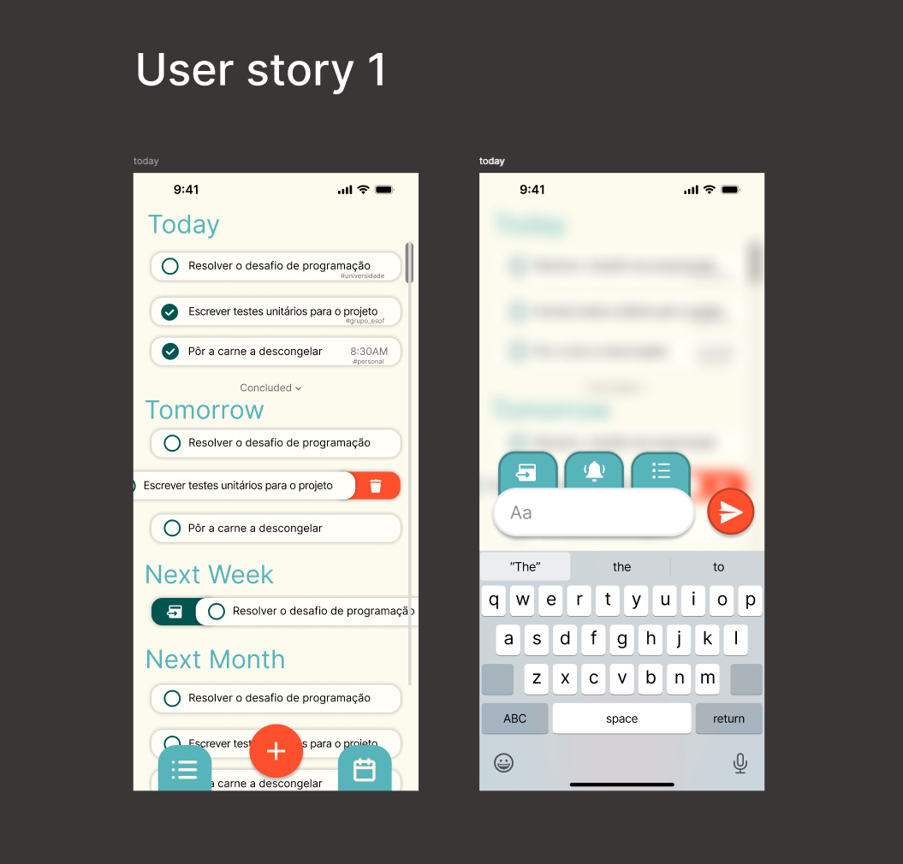  

##### ✅ Acceptance Test 
###### 🎯 Purpose:
To verify that clicking the bell button enables notifications for a task, allowing the user to select the day and hour before a task they want to be reminded.  

###### ⚙️ Preconditions: 
- A task exists, and its notifications are initially disabled (bell icon is not highlighted)  
- The user interface includes a bell icon and a pop-up menu with options  

###### 🛠️ Steps: 
1. Select a task from the task list or screen  
2. Click on the bell button associated with the task  
3. Observe the pop-up menu displaying selectable options  
4. Select one of the options  

###### ✔️ Expected outcome: 
- The bell icon changes to a highlighted state, visually confirming that notifications are enabled  
- The selected option is stored by the system  
- A notification is scheduled in the system to trigger at the designated time for the task  

###### 🔍 Validation: 
- Verify that the bell icon is highlighted after the option is selected  
- Ensure that the notification triggers at the configured time, containing details such as the task title and reminder settings  
- Confirm that the system stores the selected time correctly and reflects it in the app's settings or logs  

##### 💎 Value: 13  
##### ⏳ Effort: 5  

---

#### 2️⃣ User Story 2 -> Reminder Notifications: Never Miss an Important Task
**As a user**, I want to receive notifications for my reminders so that I don't forget important tasks.  
The system should alert users based on configured deadlines or reminder settings, supporting both individual and shared reminders.  

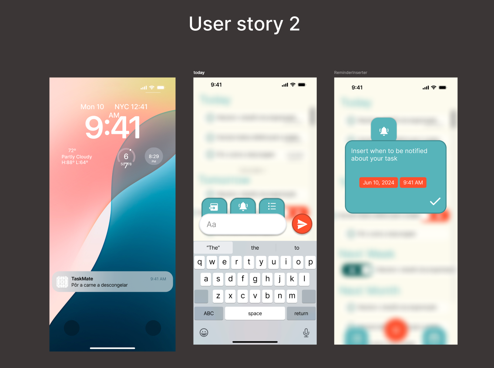  

##### ✅ Acceptance Test 
###### 🎯 Purpose:
To verify that clicking the bell button enables notifications for a task, allowing the user to select the day and hour before a task they want to be reminded.  

###### ⚙️ Preconditions: 
- A task exists, and its notifications are initially disabled (bell icon is not highlighted)  
- The user interface includes a bell icon and a pop-up menu with options  

###### 🛠️ Steps: 
1. Select a task from the task list or screen  
2. Click on the bell button associated with the task  
3. Observe the pop-up menu displaying selectable options  
4. Select one of the options  

###### ✔️ Expected outcome: 
- The bell icon changes to a highlighted state, visually confirming that notifications are enabled  
- The selected option is stored by the system  
- A notification is scheduled in the system to trigger at the designated time for the task  

###### 🔍 Validation: 
- Verify that the bell icon is highlighted after the option is selected  
- Ensure that the notification triggers at the configured time, containing details such as the task title and reminder settings  
- Confirm that the system stores the selected time correctly and reflects it in the app's settings or logs  

##### 💎 Value: 8  
##### ⏳ Effort: 5  

---

#### 3️⃣ User Story 3 -> Task Management: Search and Filter
**As a user**, I want to search and filter tasks by status or priority so that I can easily find what I need.  
The feature improves productivity by allowing users to sort tasks quickly according to urgency, category, or completion status.  

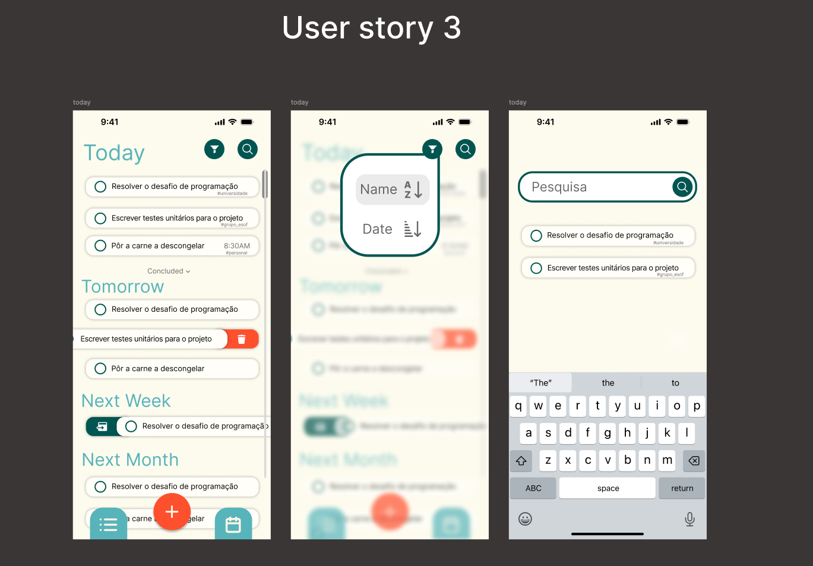  

##### ✅ Acceptance Test 
###### 🎯 Purpose:
To verify that the user can filter tasks using selectable options to prioritize tasks effectively.  

###### ⚙️ Preconditions: 
- The app is running, and the user is on the main task screen  
- A list of tasks exists with varying properties that can be filtered by the provided options  

###### 🛠️ Steps: 
1. Navigate to the main task screen  
2. Tap on the filter icon (magnifying glass or funnel) in the top-right corner  
3. View the presented options for filtering tasks by priority (e.g., "Alphabetic Order", "Date")  
4. Select one of the options provided to filter tasks  
5. Verify that the displayed tasks align with the selected filter option  
6. Combine filtering options, such as selecting "Alphabetic Order" priority alongside another category, if available  
7. Verify that the displayed tasks meet all the selected filtering criteria  

###### ✔️ Expected outcome: 
- Choosing a filter option displays only the tasks that align with the selected property (priority)  
- Combining multiple filtering options displays tasks that match all selected criteria  

###### 🔍 Validation: 
- Verify that the search bar filters tasks accurately based on the filter option  
- Ensure that status and priority filters work independently and show the correct filtered tasks  
- Confirm that combining search and filter narrows down tasks correctly according to both criteria  

##### 💎 Value: 13  
##### ⏳ Effort: 8  

---

#### 4️⃣ User Story 4 -> Reminder Organization: View by Group and Date for Better Navigation
**As a user**, I want to view reminders by group and by date so that I can navigate more easily.  
This allows users to filter and visualize reminders in a structured way, improving usability and information access.  

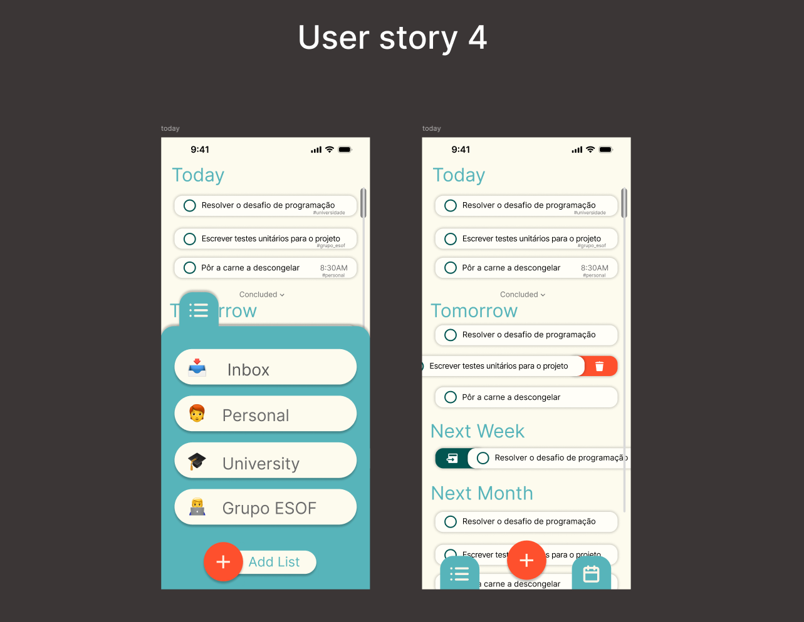  

##### ✅ Acceptance Test 
###### 🎯 Purpose:  
To verify that the user can view reminders organized by group and date, making navigation easier and improving usability.  

###### ⚙️ Preconditions:  
- The app is running, and the user is on the main reminders screen  
- Reminders exist, categorized into groups (e.g., Personal, University) and organized by dates (e.g., Today, Tomorrow, Next Week)  

###### 🛠️ Steps:  
1. Open the app and navigate to the main reminders screen  
2. Tap on the Groups section to view reminders filtered by group (e.g., Personal, University)  
3. Verify that the reminders for the selected group are displayed  
4. Tap on the Date section to view reminders categorized by date (e.g., Today, Tomorrow, Next Week)  
5. Verify that the reminders are displayed according to the selected date category  

###### ✔️ Expected Outcome:  
- Tapping on a group displays only the reminders associated with that group  
- Tapping on a date displays only the reminders due on the selected date (e.g., Today or Next Week)  
- The user can easily switch between group-based and date-based views  

###### 🔍 Validation:  
- Verify that selecting a group filters and displays reminders specific to the group  
- Ensure that selecting a date filters and displays reminders specific to the date  
- Confirm that switching between group and date views operates smoothly without errors or delays  

##### 💎 Value: 5  
##### ⏳ Effort: 5  

---

#### 5️⃣ User Story 5 -> Flexible Reminder Views: Daily, and Monthly Planning
**As a user**, I want to view my reminders in different formats — daily agenda, and monthly calendar — so that I can have a clear and organized overview of my commitments and better plan my time in the short, medium, and long term.  
This feature supports different visualization modes and helps users manage time more effectively.  

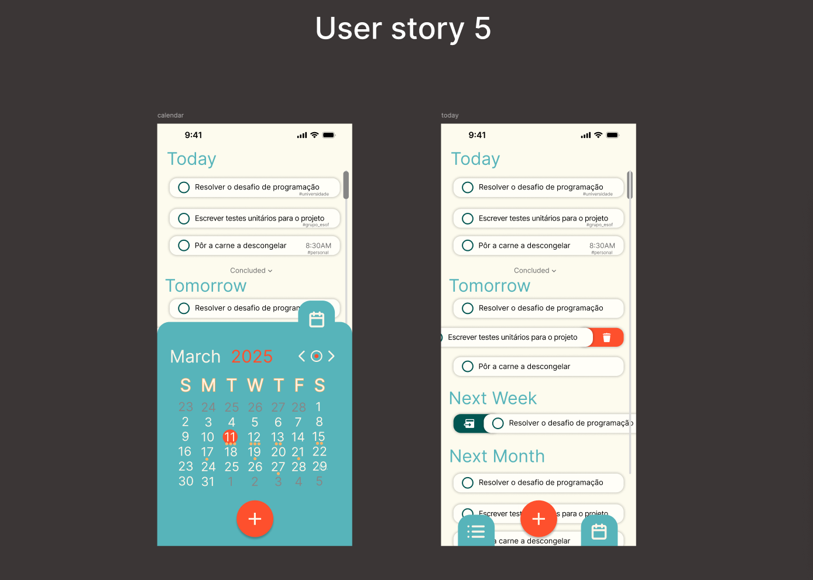  

##### ✅ Acceptance Test
###### 🎯 Purpose:  
To verify that the user can switch between daily agenda and monthly calendar views to clearly organize their commitments and better plan their time.  

###### ⚙️ Preconditions:  
- The app is running, and the user is on the reminders screen  
- The app includes options to switch between daily agenda and monthly calendar views  
- Tasks and reminders are already created, with different due dates  

###### 🛠️ Steps:  
1. Open the app and navigate to the reminders screen  
2. Tap on the Daily Agenda view option  
3. Verify that tasks and reminders are displayed in a list format, grouped by date (e.g., Today, Tomorrow, Next Week)  
4. Tap on the Monthly Calendar view option  
5. Verify that a calendar is displayed, with markers or indicators on days that have reminders  
6. Tap on a specific date in the calendar view  
7. Verify that the reminders due on that date are displayed below the calendar or in a popup  

###### ✔️ Expected Outcome:  
- In the Daily Agenda view, tasks and reminders are clearly displayed in a grouped list format based on their due dates  
- In the Monthly Calendar view, tasks and reminders are visually represented on their respective due dates using markers or icons  
- Clicking on a specific date in the calendar view shows only the tasks or reminders scheduled for that date  

###### 🔍 Validation:  
- Confirm that the Daily Agenda view organizes reminders by timeframes (e.g., Today, Tomorrow)  
- Ensure that the Monthly Calendar view visually represents reminders with markers or icons on corresponding dates  
- Verify that selecting a date in the calendar view shows only the tasks or reminders associated with that date  

##### 💎 Value: 8  
##### ⏳ Effort: 13  

---

### 🧩 Domain Model

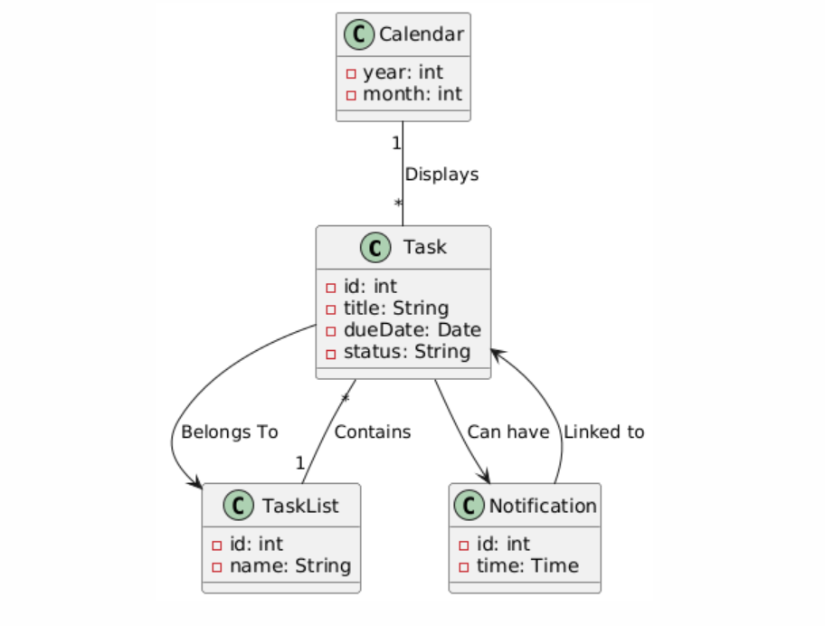  

#### 📝 Textual description
The task management application consists of several entities that interact with each other to allow users to efficiently manage their tasks. Below is a textual description of the domain model.  

##### 🔹 Entities and Relationships
###### 1. Task
Represents an individual task.  
**Attributes**:  
- `id`: Unique identifier  
- `title`: Task description  
- `dueDate`: Date when the task is due  
- `status`: Status (e.g., pending, completed)  

**Associations**:  
- Belongs to a TaskList (optional)  
- Can have a Notification (optional)  

###### 2. TaskList
Represents a category or grouping of tasks.  
**Attributes**:  
- `id`: Unique identifier  
- `name`: Name of the list (e.g., Inbox, Personal, University, Grupo ESOF)  

**Associations**:  
- Contains multiple Task objects  

###### 3. Calendar
Represents a monthly view where tasks can be assigned to specific dates.  
**Attributes**:  
- `year`: The current year  
- `month`: The current month  

**Associations**:  
- Displays Task objects based on their due dates  

###### 4. Notification
Represents a reminder or alert associated with a task.  
**Attributes**:  
- `id`: Unique identifier  
- `time`: The time when the notification should be triggered  

**Associations**:  
- Linked to a Task  

#### 🖥️ User Interface(UI) Components
1. **Homepage**: Displays categorized tasks by date sections (Today, Tomorrow, Next Week, Next Month)  
2. **Add Task screen**: Allows users to input new tasks  
3. **Lists Screen**: Shows tasks within a monthly calendar  

---

## 🏗 Architecture and Design

### 🔧 Logical Architecture
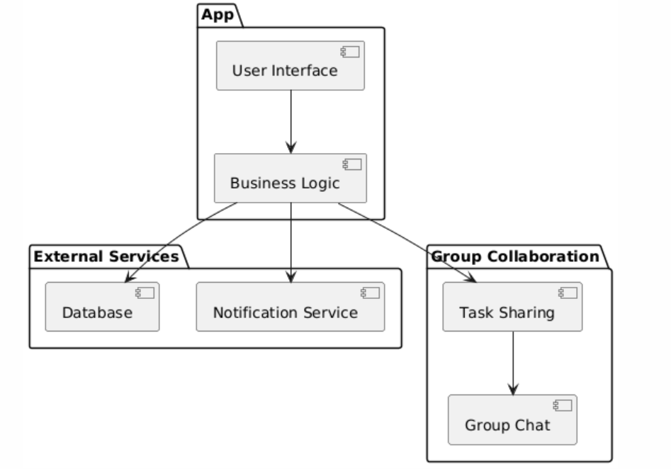  

#### 📝 Textual description 
The logical architecture of the reminder app is designed to ensure modularity, scalability, and efficient interaction between components. It is structured into four main layers:  

1. **User Interface Layer**: Handles user interactions via screens like Homepage, Add Task Screen, Lists Screen, and Calendar Screen  
2. **Business Logic Layer**: Manages task operations, group collaboration, and notifications  
3. **Data Access Layer**: Connects to the database for data storage and retrieval, ensuring data consistency  
4. **External Services Layer**: Integrates external functionalities like authentication and notifications  

---

### ⚙️ Physical Architecture
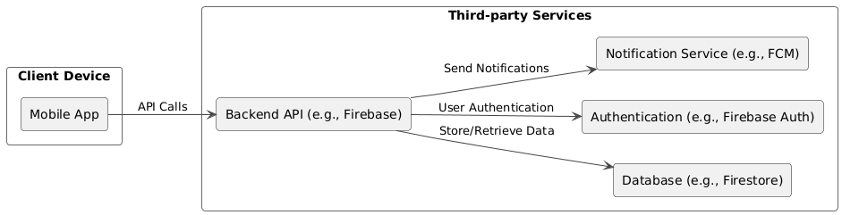  

#### 📝 Textual description
The physical architecture of the reminder app is designed to ensure reliability, scalability, and seamless communication between its components. It consists of three main nodes:  

1. **Client Device**: Represents the user's mobile app, where all interactions take place  
2. **Backend Server**: Handles all core processing, including application logic and database communication  
3. **External Services**: Supports the app with third-party functionalities like notifications (reminders) and user authentication  

---

### 🔬 Vertical Prototype
*[Prototype description would go here]*  

---

## 📅 Project Management

### 🔄 Sprint 0
*[Sprint 0 details would go here]*  

### 🔄 Sprint 1
#### Before:
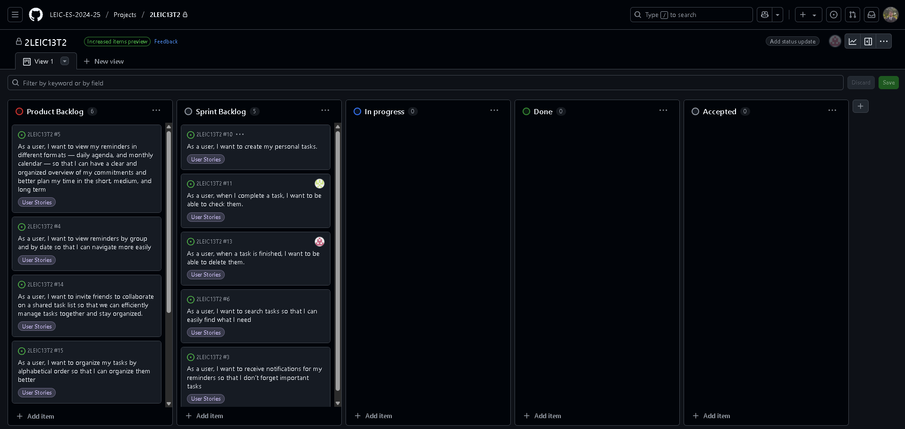
#### After:
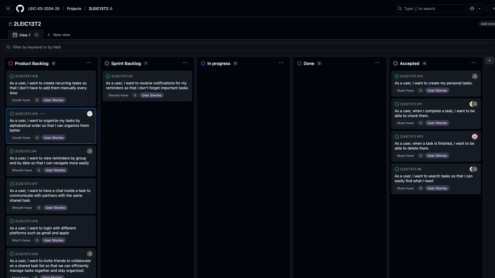

### 🔄 Sprint 2
*[Sprint 2 details would go here]*  

### 🔄 Sprint 3
#### Before:
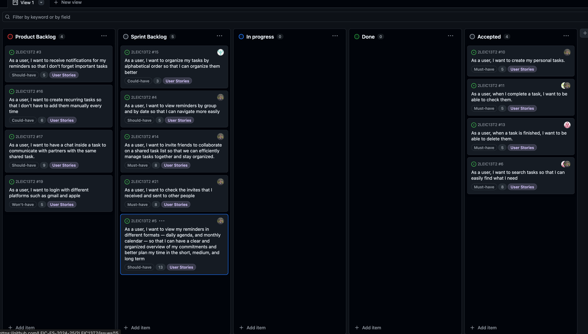
#### After:
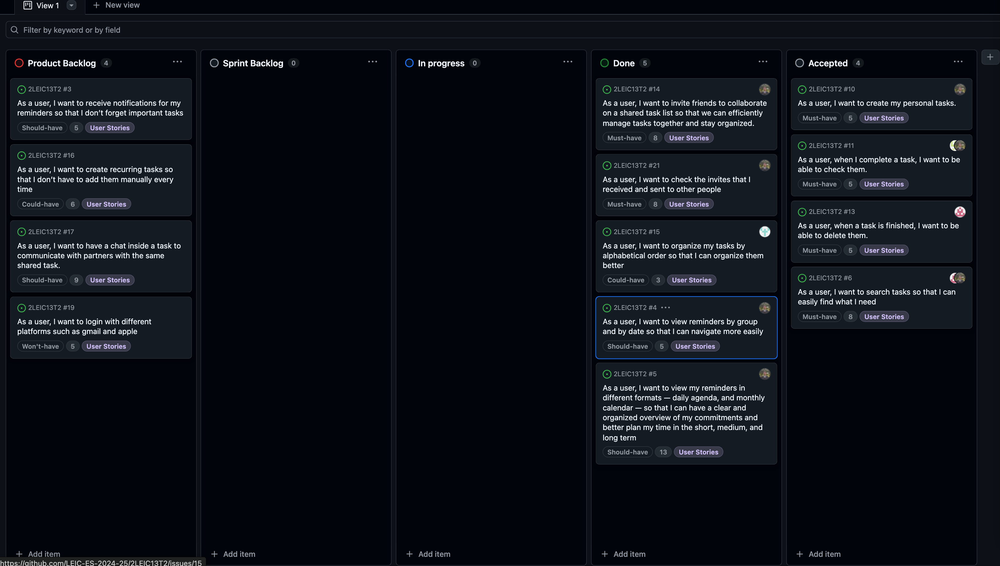

### 🔄 Sprint 4
*[Sprint 4 details would go here]*  

### 🏆 Final Release
*[Final release details would go here]*  

---

## 👥 Team
| Member             | Contact                     |
|--------------------|-----------------------------|
| **Luís Martins**   | up202304025@up.pt           |
| **Rafael Cunha**   | up202304901@up.pt           |
| **Santiago Ferreira** | up202304904@up.pt        |
| **Tiago Sousa**    | up202306955@up.pt           |

---

🌟 **Thank you for checking out TaskMate!** Let's make productivity fun and effortless together! 🚀
