# LDTS_T15_G01 - THE INVADERS

## Game Description
>The Invaders is a retro-inspired arcade game that combines classic gameplay mechanics with a customizable theme and simple mechanics. It consists in a fixed shooter in which the player moves horizontally across the bottom of the screen and fires at enemies overhead. In our project we tried to make an arcade game that combines classic gameplay mechanics with a customizable theme, while using some of the Design Patterns learn during the classes and implementing some testing mechanisms.
For a more detailed version click [here](./docs/README.md).

## Screenshots

The following screenshots ilustrate the general look of our game, as well as the divergent functionalities:

### Game GIF
### **Space invaders Theme**
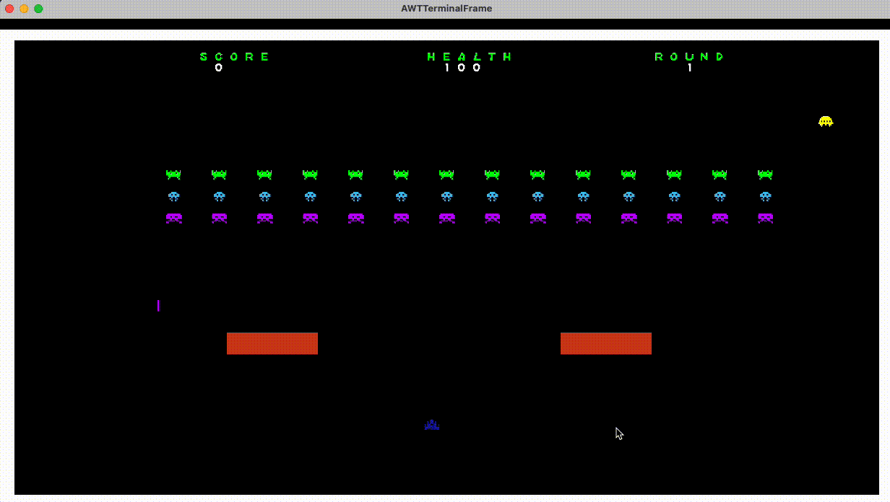
### **PAC-MAN Theme**
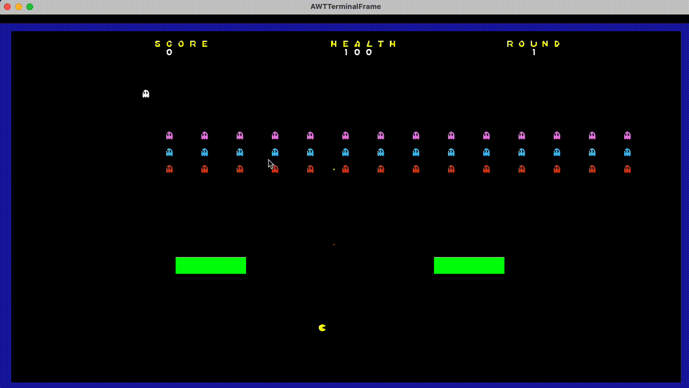

### Menus

### **Start Menu**
### **Space invaders Theme**
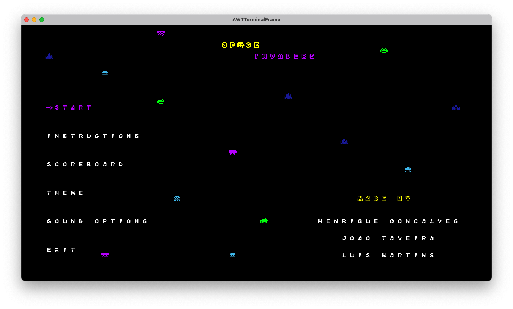
### **PAC-MAN Theme**
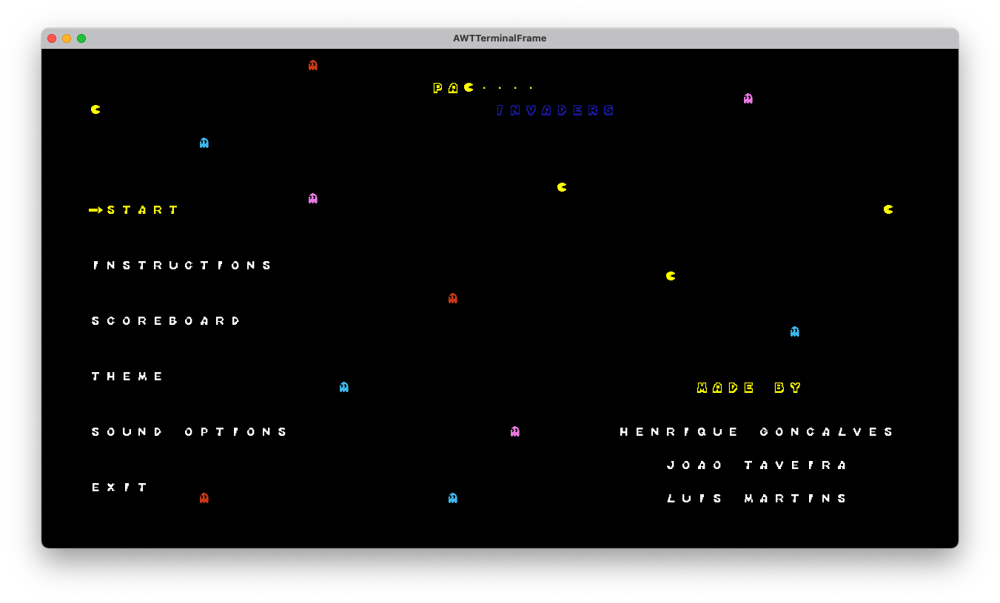

### **Theme Menu**
### **Space invaders Theme**
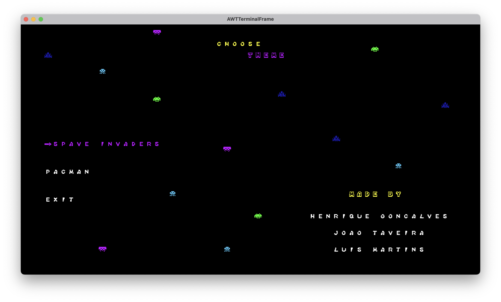
### **PAC-MAN Theme**
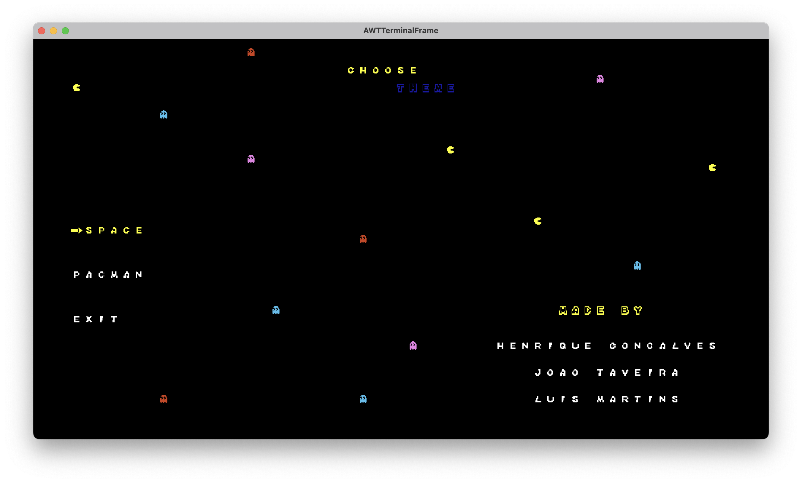

### **Instructions Menu**
### **Space invaders Theme**
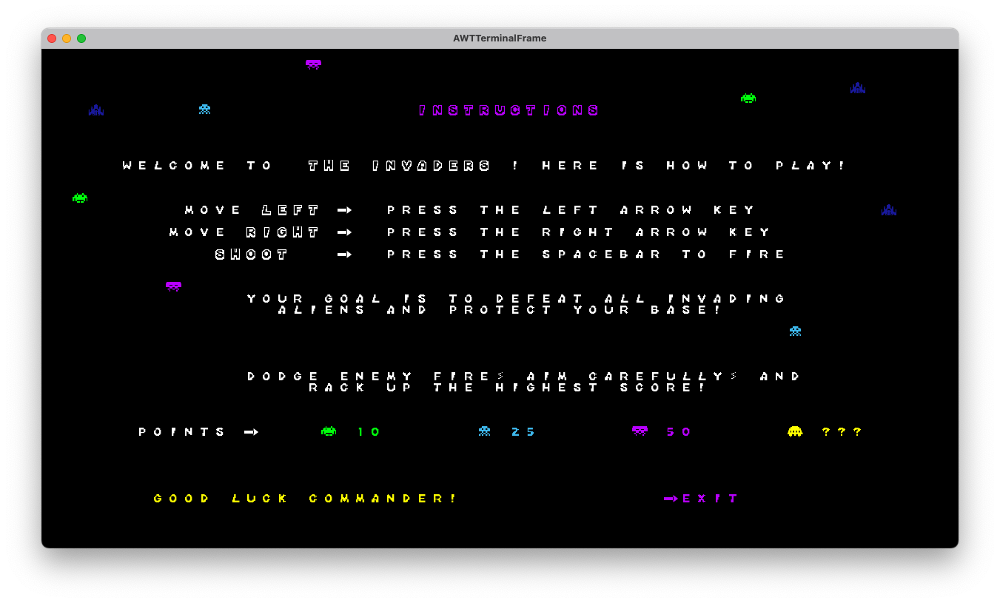
### **PAC-MAN Theme**
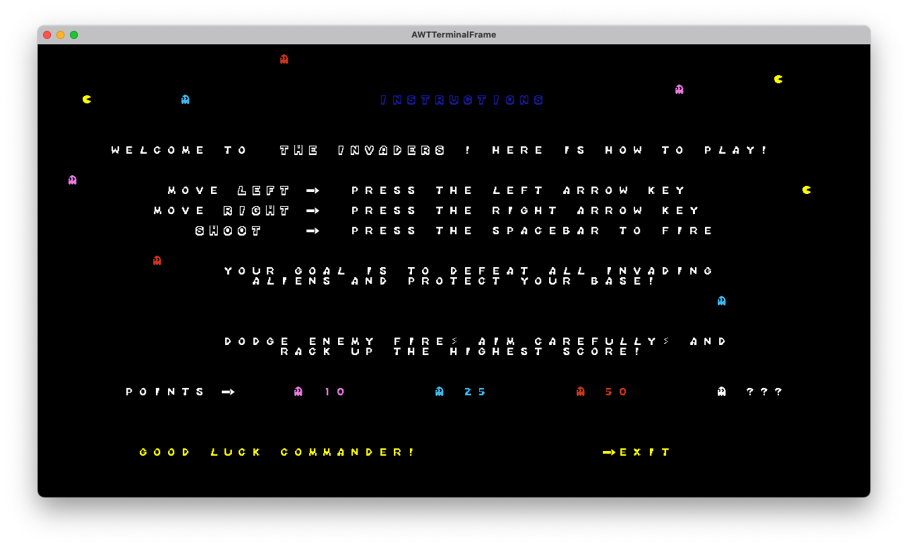

### **Scoreboard Menu**
### **Space invaders Theme**
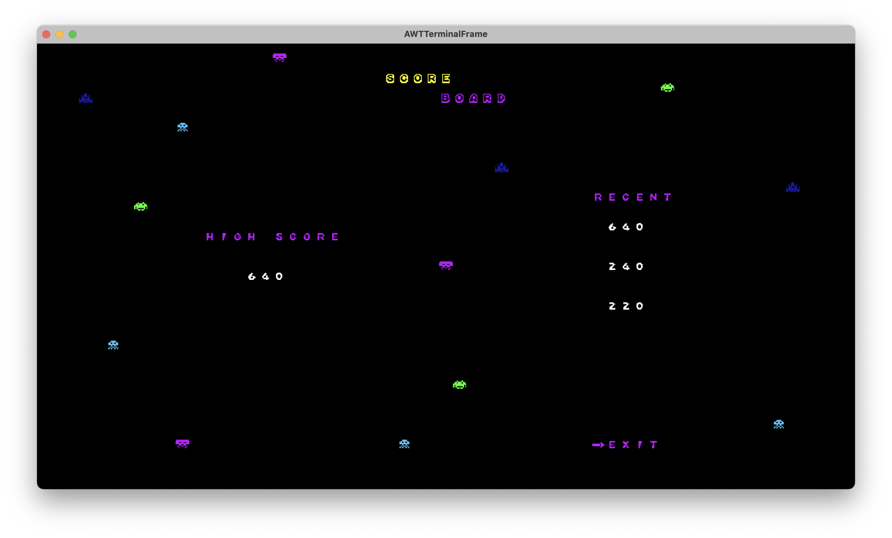
### **PAC-MAN Theme**
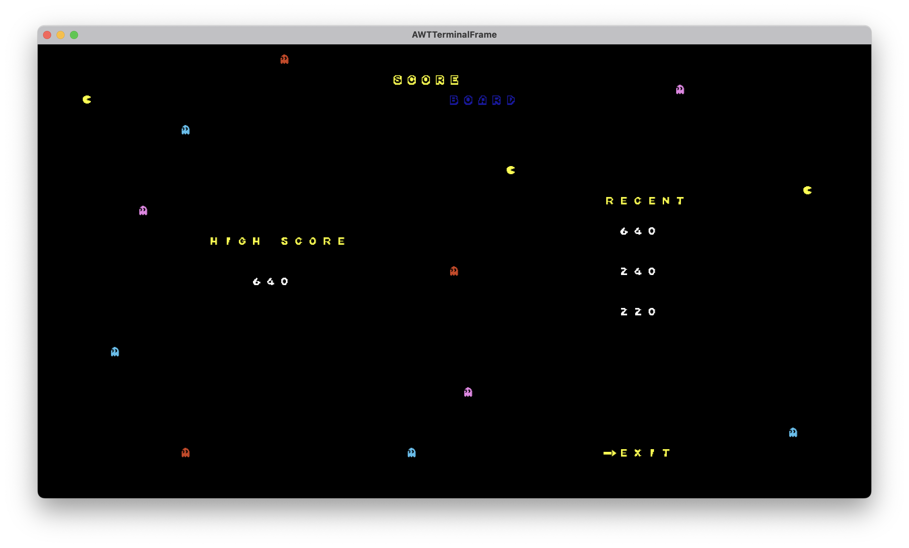

### **Pause Menu**
### **Space invaders Theme**
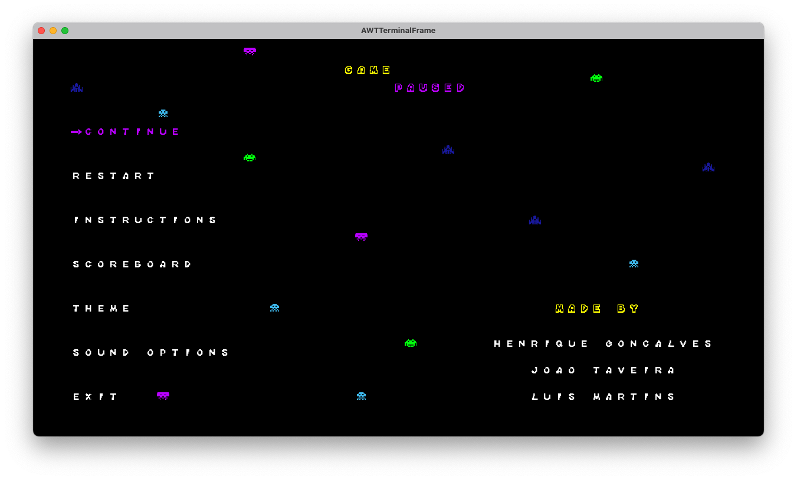
### **PAC-MAN Theme**
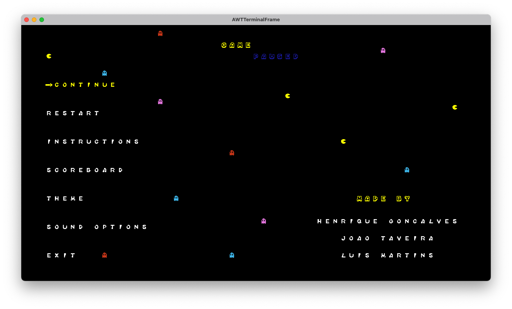

### **Game Over Menu**
### **Space invaders Theme**
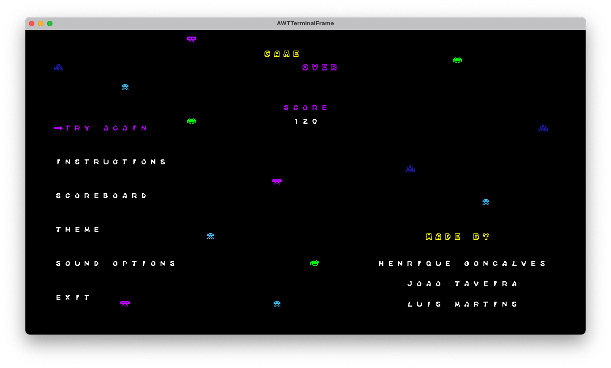
### **PAC-MAN Theme**
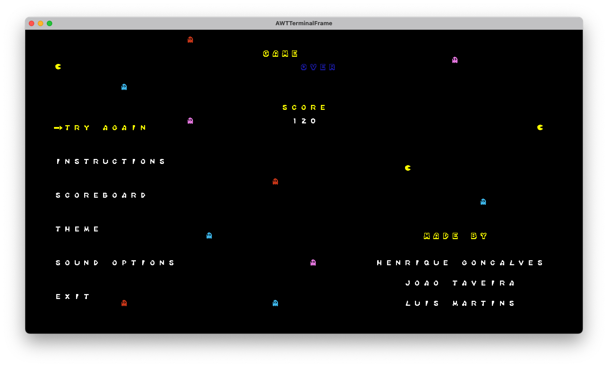

### Sound Options
### **Space invaders Theme**
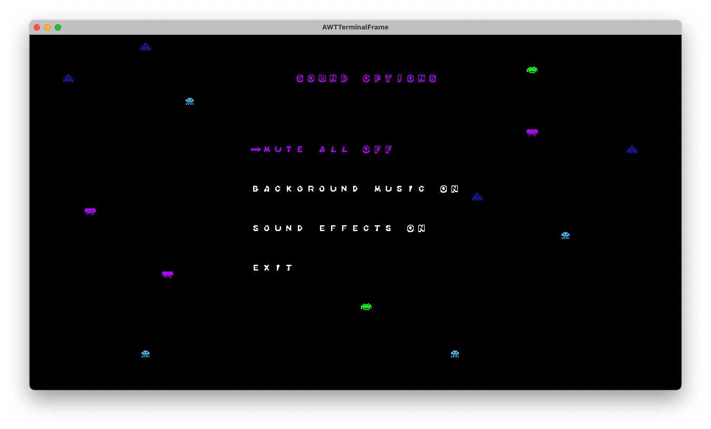
### **PAC-MAN Theme**
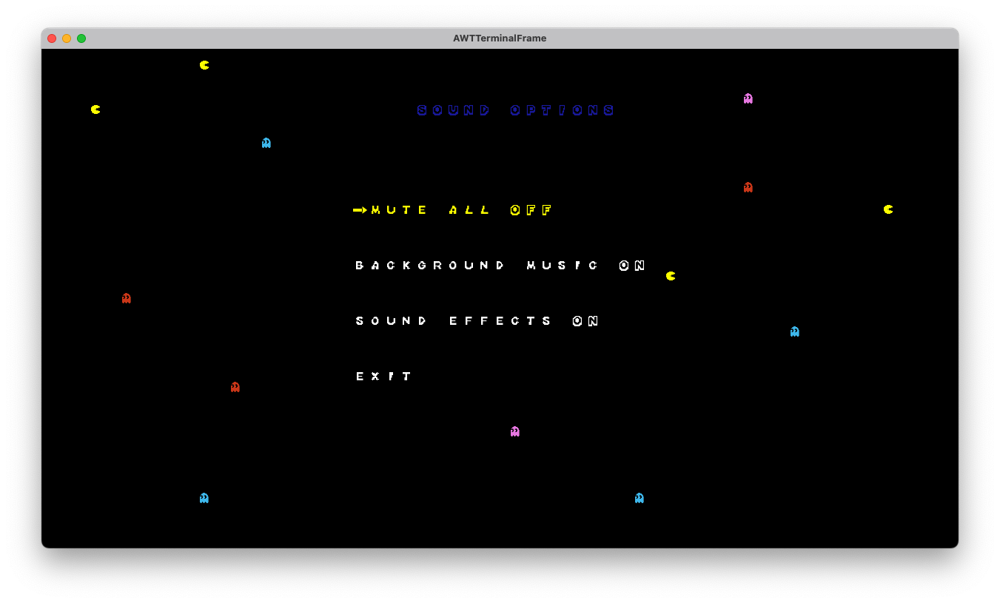