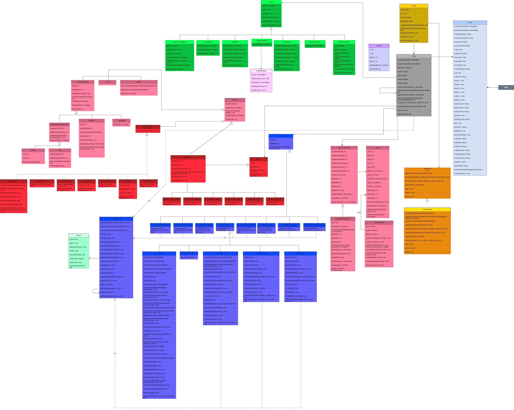
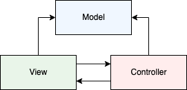
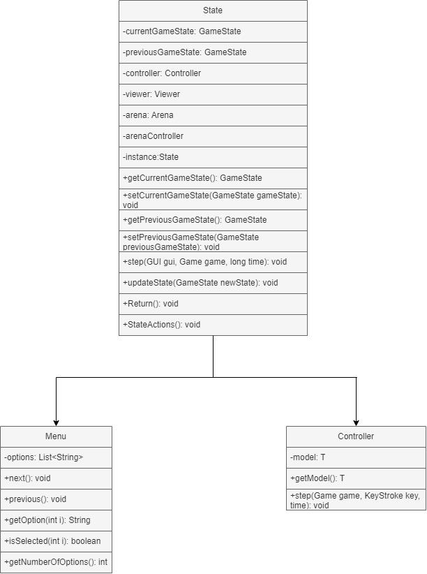
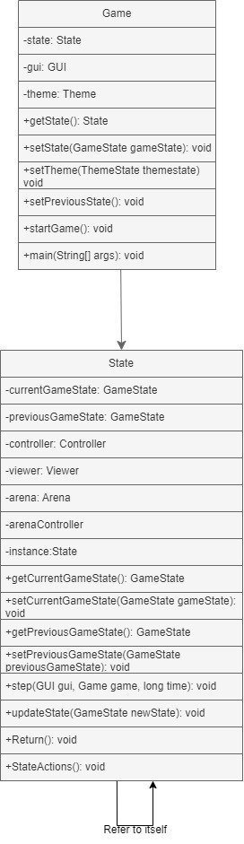
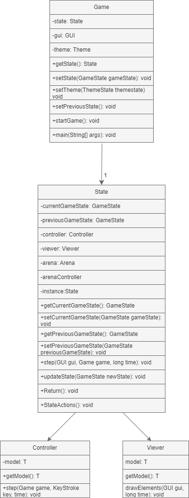
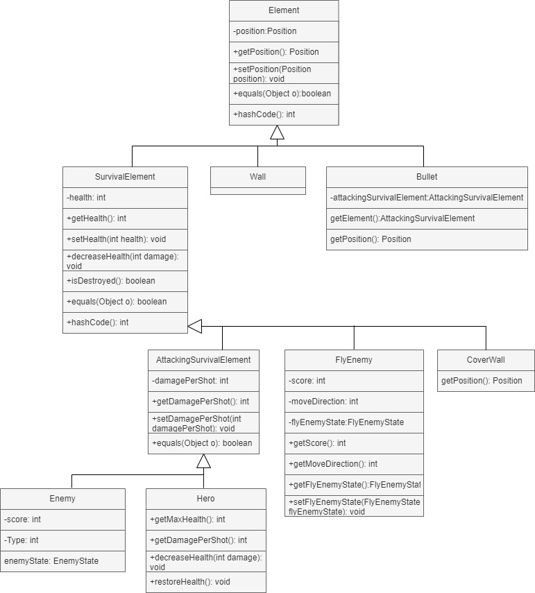

# LDTS_Group1501 - ***The Invaders***

>The Invaders is a retro-inspired arcade game that combines classic gameplay mechanics with a customizable theme and simple mechanics. It consists in a fixed shooter in which the player moves horizontally across the bottom of the screen and fires at enemies overhead. In our project we tried to make an arcade game that combines classic gameplay mechanics with a customizable theme, while using some of the Design Patterns learn during the classes and implementing some testing mechanisms.

**Authors:** Luis Martins (up202304025), Henrique Gonçalves (up202307344) e João Taveira (up202306063) for the our LDTS project.

## Implemented Features
- **Fully Functional Game** - From the health points through the shooting and scoreboards, all our game is 100% functional.
- **Changeable themes** - In the theme menu you can choose the theme you want for your game and all the menus.
- **Hero Character** - Our character is either PAC-Man or the original spaceship, that can be moved by using the Left and Right Arrows and can shoot by pressing the space.
- **Enemy Characters** - The enemy characters are either the ghosts from "PAC-Man" or the Aliens from "Space Invaders"
- **Progressively Harder Levels** - In the game we made 5 different levels where we can test our ability.
- **Arena** - The place where the game takes place
- **Cover Walls** - Walls that protect the player from enemy's attacks. These walls can also be broken by shooting at them
- **Functional Scoreboard** - The Scoreboard saves the 3 more recent scores and also the biggest score made by the player.
- **Music and Sound Effects** - Our game has changeable music and sound effects depending on the chosen menu. Both these options can be muted on the Start Menu.

## GAME CONTROLS

- **Menus**

  **Menu Navigation** - Up and Down arrow Keys;

  **Selection** - Enter Key;

- **Game**

  **Shoot** -  Space key;

  **Movement** -  Left and Right Arrow Keys;

  **Pause Game** - Escape Key.

## Game GIF
#### **Space invaders Theme**

#### **PAC-MAN Theme**

## Menus

### **Start Menu**
#### **Space invaders Theme**

#### **PAC-MAN Theme**

### **Theme Menu**
#### **Space invaders Theme**

#### **PAC-MAN Theme**

### **Instructions Menu**
#### **Space invaders Theme**

#### **PAC-MAN Theme**

### **Scoreboard Menu**
#### **Space invaders Theme**

#### **PAC-MAN Theme**

### **Pause Menu**
#### **Space invaders Theme**

#### **PAC-MAN Theme**

### **Game Over Menu**
#### **Space invaders Theme**

#### **PAC-MAN Theme**

### Sound Options
#### **Space invaders Theme**

#### **PAC-MAN Theme**

## Testing
### Coverage report
### Mutation Testing report

## UML GERAL

## Design Patterns

### **1. Model-View-Controller Pattern (MVC) Analysis**
- **Description:** The project adopts the MVC pattern to separate concerns between the data, user interface, and application logic.
- **Evidence in Code:**
  - **Model:** The `Model` package contains classes like `Hero`, `Enemy`, and `Bullet`, which represent game entities and their data.
  - **View:** The `Viewer` package contains classes like `GameViewer` and `MenuViewer` for rendering visual elements based on the state of the `Model`.
  - **Controller:** The `Controller` package contains logic for user inputs (`HeroController`) and game management (`GameController`).
- **Benefit:** Enhances modularity and allows independent development of the user interface, game logic, and data.

### **2. State Pattern Analysis**
- **Description:** Used to manage the game's state transitions effectively.
- **Evidence in Code:**
  - The `Game` class manages a `State` instance, which switches between states like gameplay and menu.
- **Benefit:** Simplifies state transitions and makes the code more maintainable by encapsulating behavior related to specific states.

### **3. Singleton Pattern Analysis**
- **Description:** Ensures that a class has only one instance and provides a global point of access to it.
- **Evidence in Code:**
  - The Game class represents the core of the application, managing the overall flow and interactions; The State class encapsulates the game's current state (`START`, `PAUSE`, etc.). By applying the Singleton pattern to both classes.
- **Benefit:** Centralizes state management and makes game instance be globally accessible.

### **4. Game Loop Pattern Analysis**
- **Description:** The Game Loop Pattern manages the game's core cycle, ensuring consistent updates and rendering regardless of the hardware's speed. This pattern divides the game logic into discrete steps: input handling, state updates, and rendering.

- **Evidence in Code:**
  - The Game class contains a startGame method that clearly implements the game loop:
    - The loop runs continuously while the game state is not `QUIT_GAME`. 
    - It ensures a fixed frame rate by calculating frameTime and adjusting the sleep time for each iteration.
    - The `state.step(gui, this, startTime)` method updates the game state and handles rendering.

### **5. Part-Whole Design Pattern Analysis**

- **Description**:
The UML illustrates a *Composite Design Pattern*, where `Element` is the base class, enabling uniform treatment of both individual parts (e.g., `Wall`, `Bullet`) and composite objects (e.g., `Hero`, `Enemy`). This pattern models the hierarchical structure of game entities, emphasizing modularity and cohesion.

- **Evidence in Code**:
  - **Hierarchy**: `Element` provides shared functionality (`getPosition()`), while subclasses like `SurvivalElement` and `AttackingSurvivalElement` add specific behaviors (`health`, `damagePerShot`).
  - **Relationships**: `Bullet` is linked to its shooter (`AttackingSurvivalElement`), and entities like `Hero` and `FlyEnemy` extend their respective roles.

- **Benefit**:
  - Promotes **reusability** and **scalability** by organizing game entities into a flexible structure.
  - Simplifies **maintenance** through centralized behavior in the base class.
  - Facilitates dynamic composition of game objects, enhancing **extensibility** for future updates.

## Code Smells
### Error Prone Warnings
#### Hash Code 
- When a class overrides the Equals method, it is essential to override the GetHashCode method as well to maintain consistency and avoid potential issues in collections or comparisons. This ensures that objects considered equal produce the same hash code.
#### Eliminated unused methods, variables and imports 
- Some methods, variables and imports that were not being used were eliminated.
#### Use of traditional switch clauses
- `/Users/luismartins/IdeaProjects/project/src/main/java/Space_Invaders/Controller/Game/EnemyController.java:79: warning: [TraditionalSwitchExpression] Prefer -> switches for switch expressions`
- Numa estrutura switch tradicional, se nos esqueceremos de colocar o break após um case, o fluxo de controlo continuará a executar os blocos de código seguintes (fall-through). Isto pode ser uma fonte comum de erros.

## Self-evaluation

The work was divided in a mutual way and we all contributed with our best. 

- Luís Martins: 33.3%
- Henrique Gonçalves: 33.3%
- João Taveira: 33.3%

