# Relatório – PKI, Certificados Digitais e Ataque MITM

## 1. Introdução

Este laboratório teve como objetivo compreender o funcionamento da Public Key Infrastructure (PKI), a utilização de certificados digitais X.509, e demonstrar como o HTTPS protege contra ataques Man-in-the-Middle (MITM).

Adicionalmente, foi demonstrado que a segurança do PKI depende fortemente da confiança nas Certificate Authorities (CA), falhando completamente quando uma CA confiável é comprometida.

## 2. Ambiente Experimental

O laboratório foi realizado utilizando:

- Máquina Virtual SEED Ubuntu
- Containers Docker fornecidos pelo SEED Project
- Servidor web Apache2
- Ferramenta OpenSSL
- Browser Mozilla Firefox

## 3. Task 1 – Criação de uma Certificate Authority (CA)

Nesta tarefa foi criada uma Certificate Authority própria, que será usada para assinar certificados.

### Passos realizados:

1. Alteração do ficheiro `myCA_openssl.cnf`:
```
   unique_subject = no
```

2. Criação da estrutura `demoCA`
3. Geração da chave privada da CA (`ca.key`)
4. Criação do certificado da CA (`ca.crt`)

### Resultado:

Foram gerados com sucesso:
- `ca.key`
- `ca.crt`
- Estrutura `demoCA`


📸 **Figuras 1,2,3,4,5** – Estrutura da CA criada e ficheiros gerados e certificado da CA (openssl x509 -text -noout ca.crt)

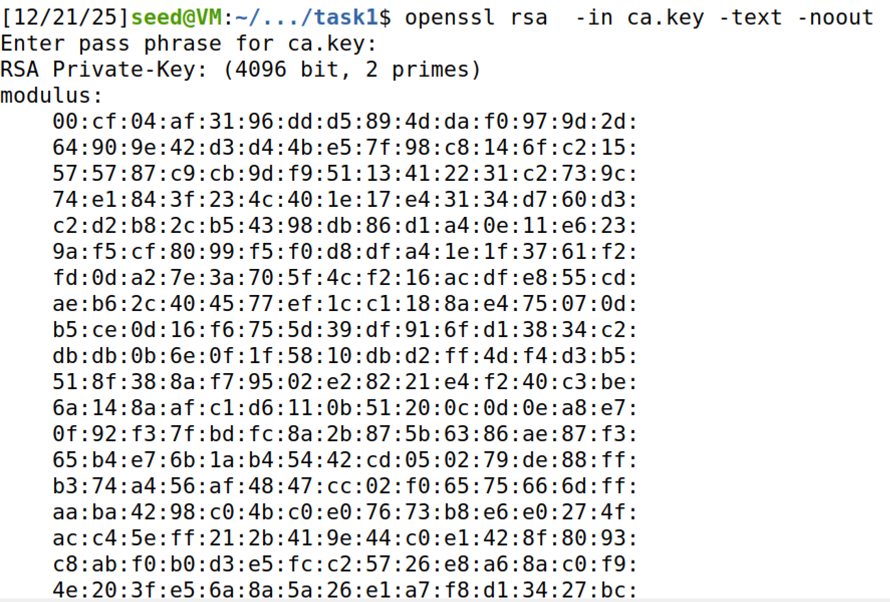


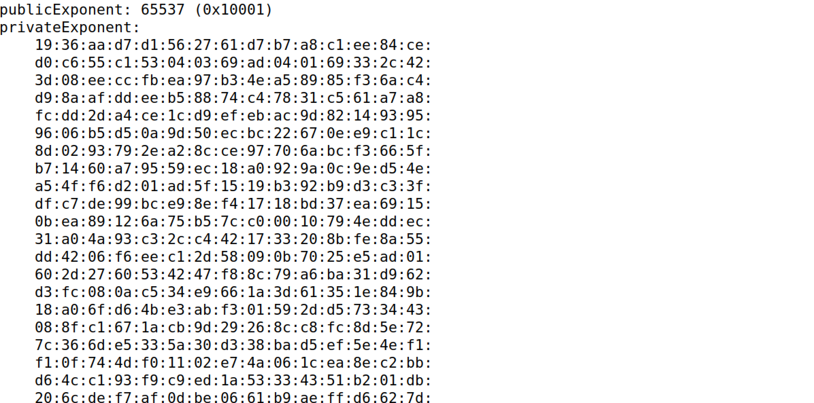


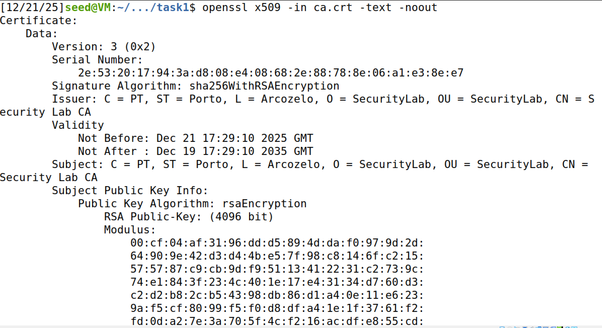


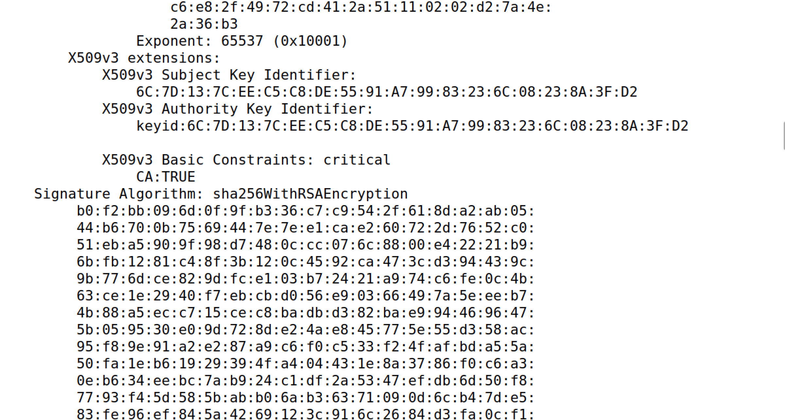


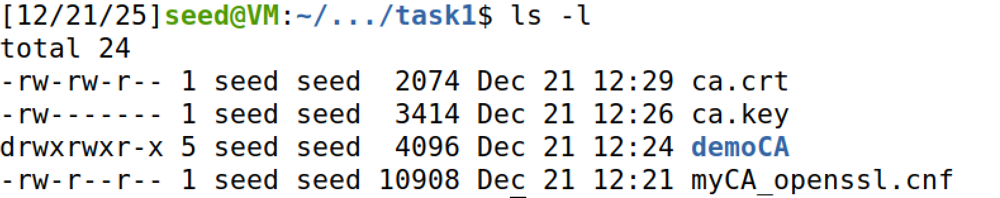


## 4. Task 2 – Criação de um CSR com SAN

Foi criado um Certificate Signing Request (CSR) para o domínio legítimo `www.juicy2025.com`, incluindo Subject Alternative Names (SAN).

### Comando utilizado:
```bash
openssl req -newkey rsa:2048 -sha256 \
-keyout server.key -out server.csr \
-subj "/CN=www.juicy2025.com/O=Juicy Inc./C=PT" \
-addext "subjectAltName=DNS:www.juicy2025.com,DNS:www.juicyA2025.com,DNS:www.juicyB2025.com"
```

### Resultado:

- `server.key`
- `server.csr`

📸 **Figuras 6 e 7** – Conteúdo do CSR com SAN (`openssl req -text -noout server.csr`)

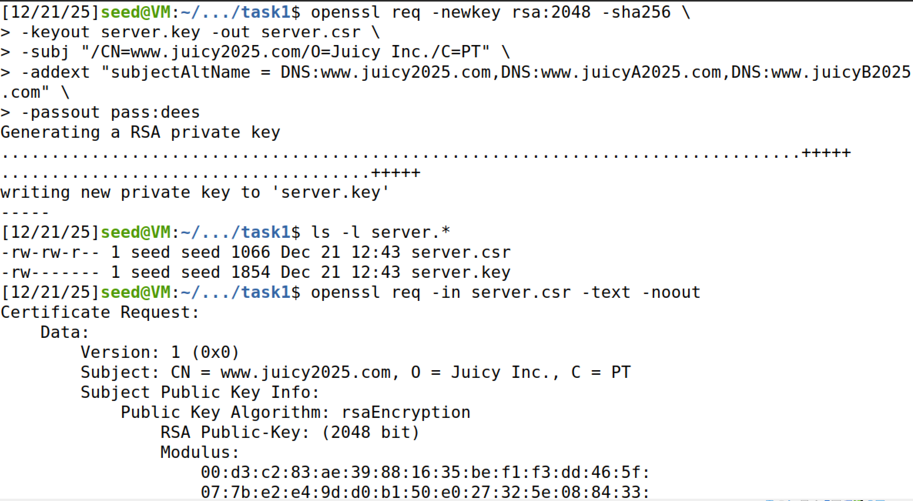

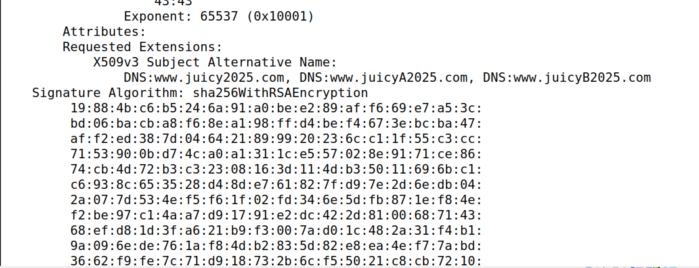


## 5. Task 3 – Assinatura do Certificado pela CA

O CSR foi assinado pela CA criada na Task 1.

### Comando utilizado:
```bash
openssl ca -config myCA_openssl.cnf \
-policy policy_anything \
-md sha256 -days 3650 \
-in server.csr -out server.crt -batch
```

### Resultado:

- Certificado final `server.crt`
- SAN corretamente incluído
- Certificado não-CA (`CA:FALSE`)

📸 **Figuras 8,9 e 10** – Certificado final (`openssl x509 -text -noout server.crt`)

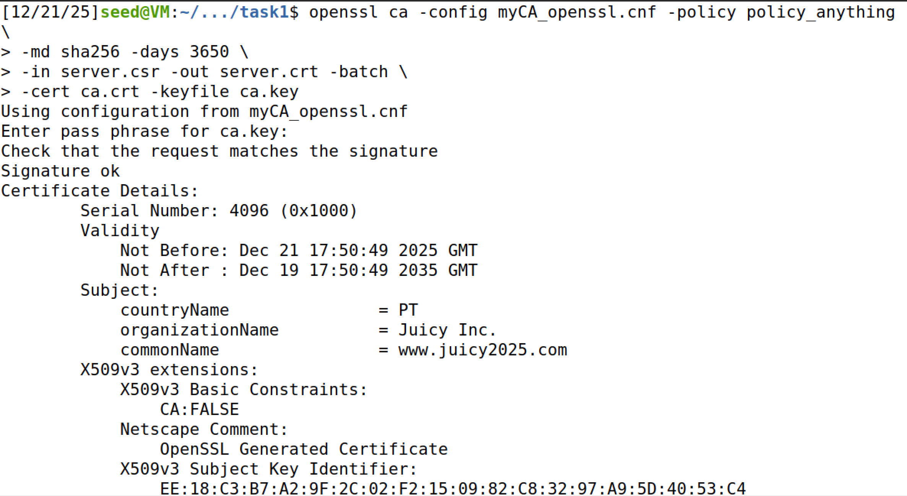
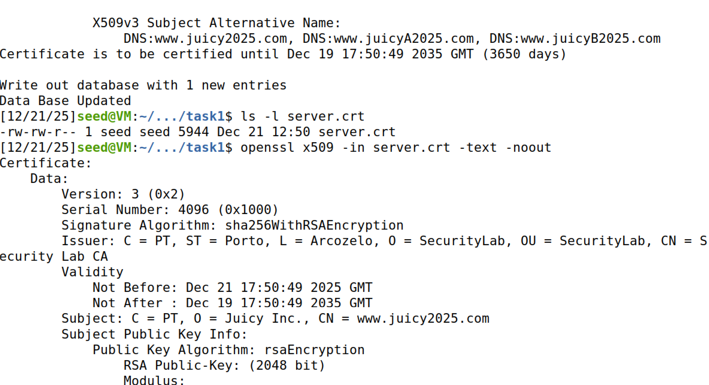
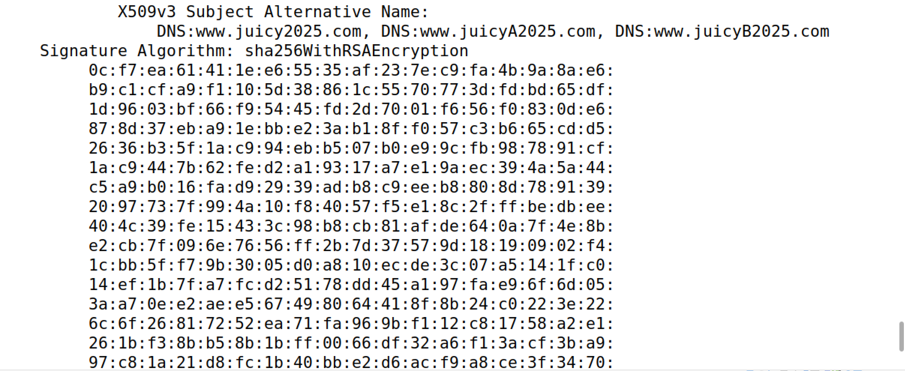


## 6. Task 4 – Configuração HTTPS no Apache

Foi configurado o Apache para servir HTTPS usando o certificado criado.

### Passos:

1. Copiar certificados para o container
2. Criar VirtualHost HTTPS
3. Ativar módulo SSL
4. Ativar o site e iniciar o Apache

### Resultado:

O site `https://www.juicy2025.com` passou a funcionar em HTTPS, mas o browser apresentou aviso de segurança, pois a CA ainda não era confiável.


📸 **Figuras 11,12 e 13** – Certificados no container, configuração do Apache HTTPS e Website HTTPS acessível no browser

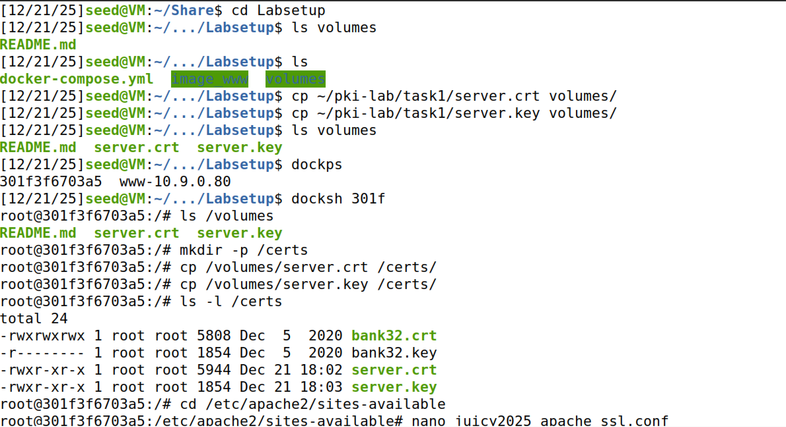
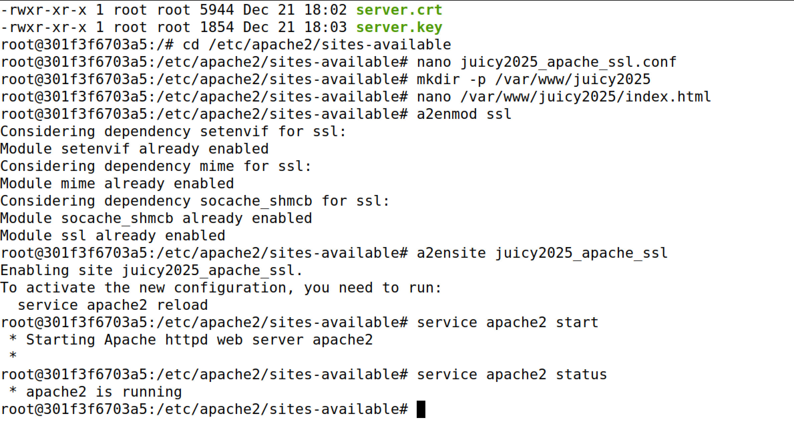


## 7. Task 5 – HTTPS a Bloquear MITM

Foi criado um site HTTPS para `www.example.com` sem comprometer a CA.

### Resultado:

- O browser bloqueou o acesso
- Foi exibido aviso de segurança
- O ataque MITM falhou

📸 **Figuras 14,15 e 16** – Aviso "Potential Security Risk Ahead" no Firefox, /etc/hosts e example_apache_ssl.conf

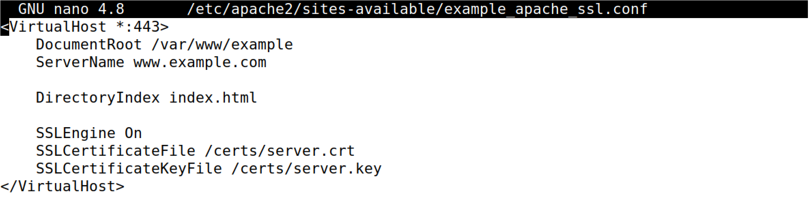
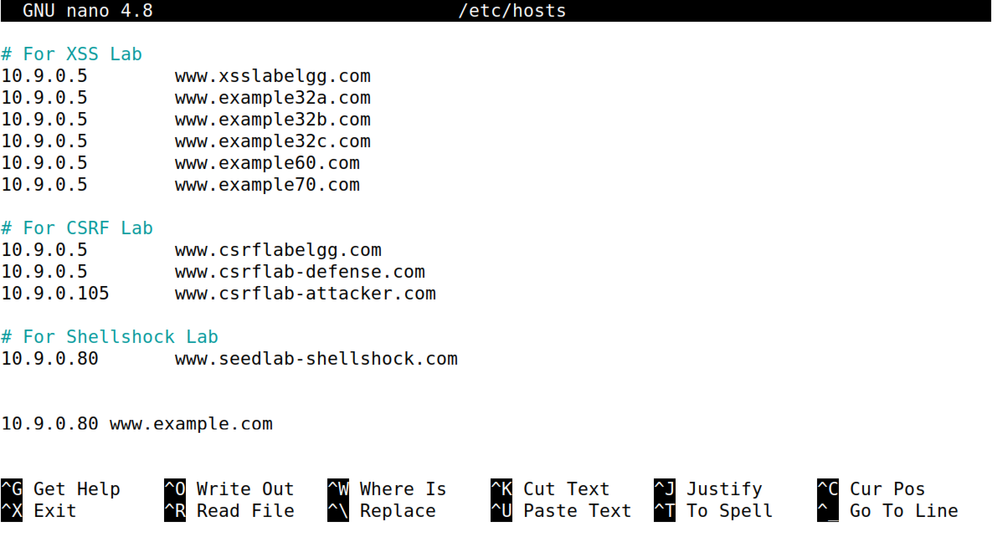
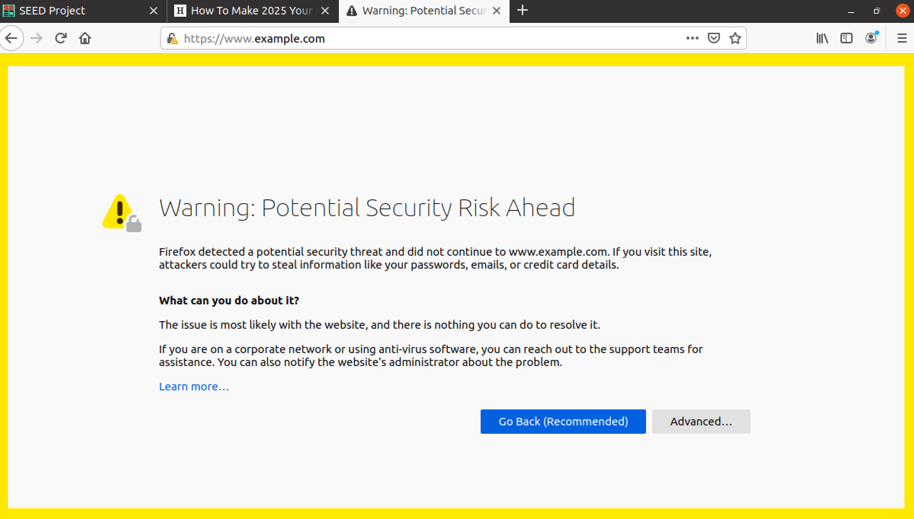


> **Nota:** Esta task demonstra que o HTTPS protege contra MITM quando a CA é confiável.

## 8. Task 6 – MITM com CA Comprometida

Nesta tarefa, simulou-se um ataque MITM realista, comprometendo uma CA confiável.

### Passos realizados:

1. Criação de um certificado falso para `www.example.com`
2. Assinatura com a CA comprometida
3. Configuração do Apache para usar o certificado falso
4. Importação da CA no Firefox como confiável
5. Verificação do certificado falso:
```bash
   openssl x509 -in example.crt -text -noout
```

### Confirmações:

- Subject: `CN = www.example.com`
- Issuer: `Security Lab CA`
- SAN: `DNS:www.example.com`
- `CA:FALSE`

📸 **Figura 17** – Certificado falso analisado com OpenSSL


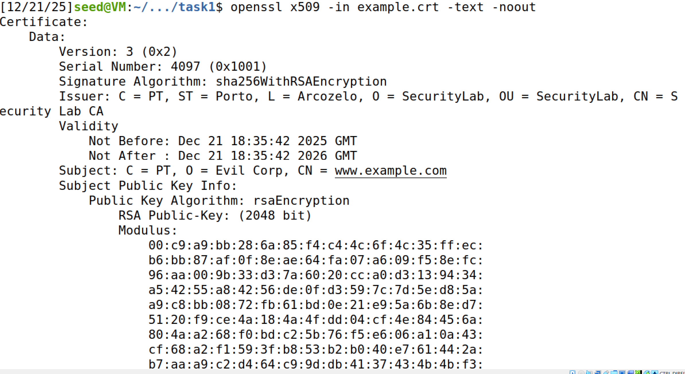


📸 **Figura 18** – VirtualHost Apache a usar `example.crt`

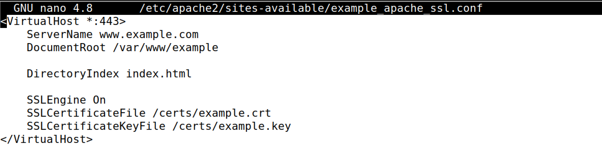


### Resultado Final:

- O browser **não apresentou qualquer aviso**
- Cadeado HTTPS exibido
- Página falsa carregada com sucesso

📸 **Figura 19** – Browser em `https://www.example.com` sem aviso (MITM bem-sucedido)

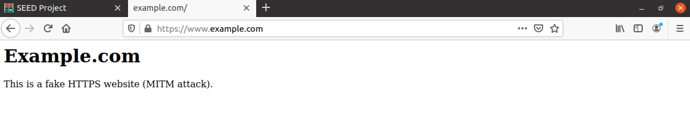


## 9. Conclusão

Este laboratório demonstrou claramente que:

- O HTTPS protege eficazmente contra ataques MITM quando a CA é confiável
- O PKI falha completamente se uma CA confiável for comprometida
- O browser não consegue distinguir um certificado legítimo de um malicioso se ambos forem assinados por uma CA confiável

### Conclusão final:

**A segurança do HTTPS depende inteiramente da integridade das Certificate Authorities. Uma CA comprometida invalida todo o modelo de confiança do PKI.**

## 10. Observações Finais

O laboratório permitiu uma compreensão prática e profunda dos mecanismos de segurança do HTTPS e das suas fragilidades estruturais, reforçando a importância da gestão rigorosa de Certificate Authorities.