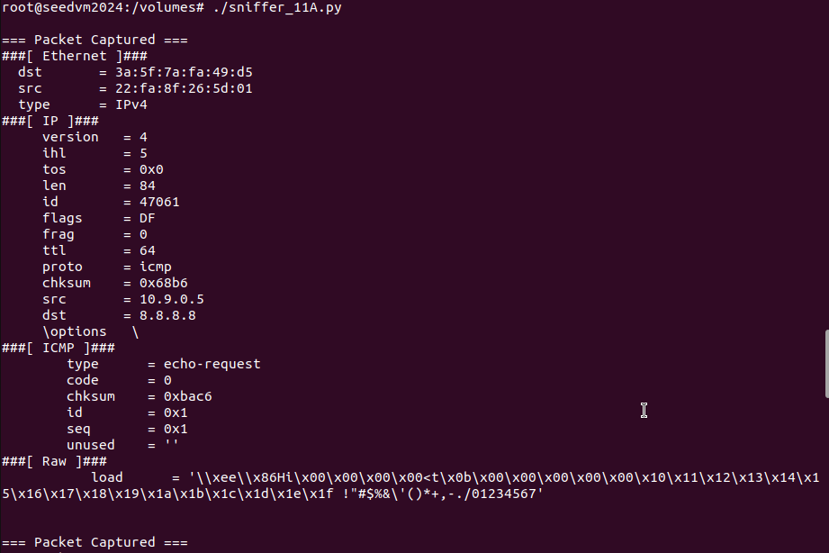
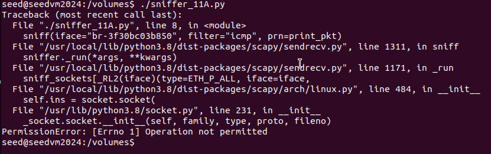
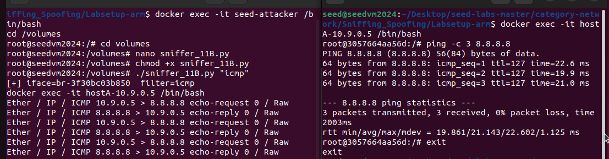
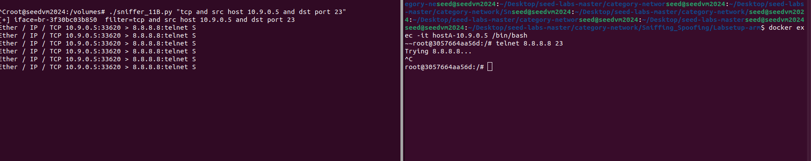
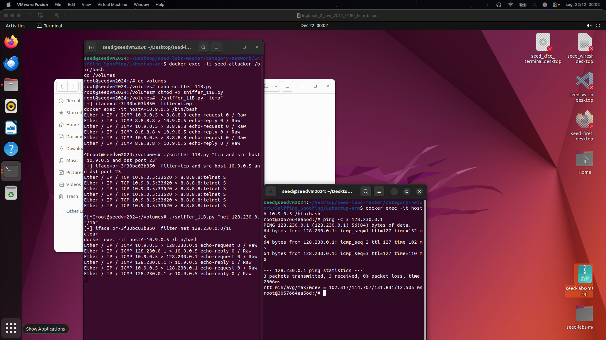
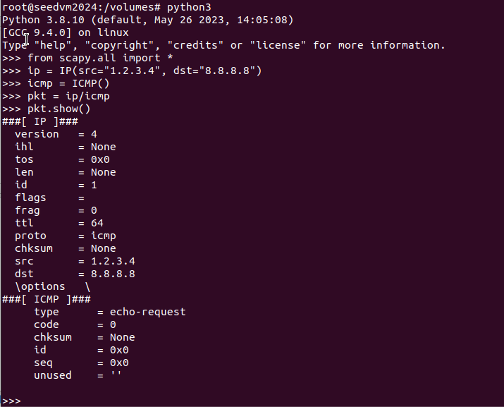
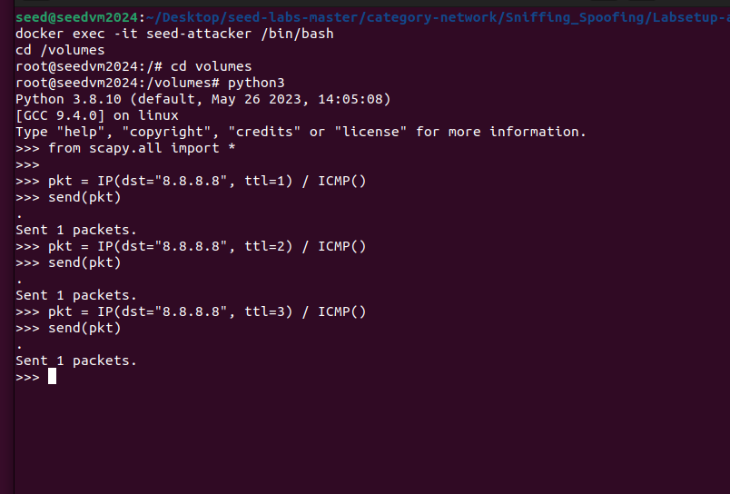
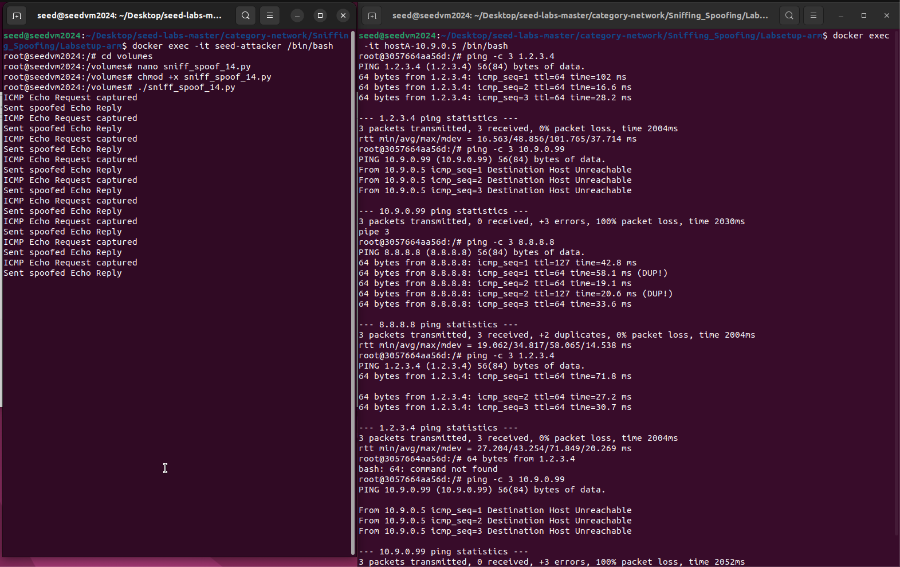

# LOGBOOK13 — Sniffing and Spoofing (Task Set 1)

## Introdução

Neste laboratório foram exploradas técnicas fundamentais de **sniffing** e
**spoofing** de tráfego de rede, recorrendo à biblioteca **Scapy** e a um
ambiente isolado com containers Docker fornecido pelo SEED Lab.

O objetivo principal foi compreender:
- como pacotes de rede podem ser capturados;
- como filtros BPF limitam o tráfego observado;
- como pacotes ICMP podem ser forjados;
- e como sniffing e spoofing podem ser combinados para produzir respostas
fraudulentas.

Todas as tarefas foram realizadas num ambiente controlado, permitindo observar
o comportamento real dos protocolos de rede sem comprometer sistemas externos.

---

## Ambiente de Trabalho

O laboratório foi executado numa máquina virtual Ubuntu, a correr sobre macOS
(Apple Silicon), utilizando o **Labsetup-arm** do SEED Lab.

- Containers utilizados:
  - `seed-attacker` (atacante)
  - `hostA-10.9.0.5`
  - `hostB-10.9.0.6`
- Rede Docker: `10.9.0.0/24`
- Interface de sniffing: `br-3f30bc03b850`
- Ferramenta principal: **Scapy (Python 3)**

---

## Task 1.1A — Packet Sniffing

### Objetivo

O objetivo desta tarefa foi capturar pacotes ICMP e analisar detalhadamente a
sua estrutura, identificando as várias camadas envolvidas na comunicação.

### Descrição

Foi implementado um sniffer simples com Scapy, configurado para escutar a
interface da bridge Docker. Para gerar tráfego, foram enviados pacotes ICMP
(`ping`) a partir dos containers `hostA` e `hostB`.

Ao executar o sniffer com privilégios de root, foi possível capturar e visualizar
os pacotes completos.

### Análise dos pacotes capturados

Os pacotes ICMP observados apresentam as seguintes camadas:

- **Ethernet**  
  Contém os endereços MAC de origem e destino, responsáveis pela entrega local
  do pacote na rede.

- **IP**  
  Inclui os endereços IP de origem e destino, o campo TTL, o protocolo utilizado
  (ICMP) e outros campos de controlo.

- **ICMP**  
  Identifica o tipo da mensagem (Echo Request ou Echo Reply), permitindo
  compreender o mecanismo de funcionamento do comando `ping`.

- **Raw**  

  Representa o payload transportado pelo pacote ICMP.

### Execução sem privilégios
Quando o sniffer é executado sem permissões de root, ocorre o erro: PermissionError: Operation not permitted

Isto acontece porque o acesso a **raw sockets** é restrito pelo sistema
operativo, uma vez que permite a captura e manipulação direta de pacotes de rede.

  


---

## Task 1.1B — BPF Filters

### Objetivo

Nesta tarefa exploraram-se filtros **BPF (Berkeley Packet Filter)** para limitar
o tráfego capturado pelo sniffer, tornando a análise mais eficiente e focada.

### Filtro ICMP

Foi utilizado o filtro: icmp

Este filtro permite capturar apenas pacotes ICMP. Ao executar `ping`, observaram-
se apenas mensagens Echo Request e Echo Reply, confirmando o funcionamento do
filtro.



### Filtro TCP com IP e porta

Foi utilizado o filtro: tcp and src host 10.9.0.5 and dst port 23

Este filtro captura apenas tráfego TCP proveniente do `hostA` com destino à
porta 23 (Telnet). Ao tentar estabelecer uma ligação Telnet, foram observados
pacotes TCP com a flag **SYN**, correspondentes ao início do handshake TCP.



### Filtro por subnet

Foi utilizado o filtro: net 128.230.0.0/16

Este filtro permite capturar apenas pacotes cujo endereço IP pertença à subnet
especificada. Ao executar `ping 128.230.0.1`, apenas tráfego dessa rede foi
capturado.



---

## Task 1.2 — ICMP Spoofing

### Objetivo

Demonstrar que é possível forjar pacotes ICMP com endereços IP de origem falsos.

### Descrição

Foi construído manualmente um pacote ICMP Echo Request, definindo
explicitamente:
- IP de origem: `1.2.3.4`
- IP de destino: `8.8.8.8`

A função `pkt.show()` foi utilizada para verificar a estrutura interna do pacote.

### Análise

A observação do pacote confirma que o protocolo IP **não valida a autenticidade
do endereço de origem**, o que constitui uma vulnerabilidade fundamental explorada
em ataques de spoofing.



---

## Task 1.3 — Traceroute

### Objetivo

Compreender o funcionamento do campo **TTL (Time-To-Live)** do cabeçalho IP e a
forma como é utilizado no mecanismo de traceroute.

### Descrição

Foram enviados pacotes ICMP com valores de TTL progressivamente maiores
(1, 2 e 3). Cada router decrementa o TTL; quando este chega a zero, o pacote é
descartado e é enviada uma mensagem ICMP Time Exceeded.

### Observações

Ao aumentar o TTL, os pacotes atingem routers cada vez mais distantes, permitindo
mapear o caminho até ao destino.



---

## Task 1.4 — Sniff and then Spoof

### Objetivo

Combinar sniffing e spoofing para responder de forma fraudulenta a pedidos ICMP.

### Descrição

Foi implementado um sniffer que:
1. Captura pacotes ICMP Echo Request;
2. Constrói uma resposta ICMP Echo Reply forjada;
3. Envia essa resposta ao emissor original.

### Resultados observados

- **Ping para IP inexistente fora da LAN (1.2.3.4)**  
  O pedido recebe resposta, apesar do IP não existir, demonstrando o sucesso do
  ataque.

- **Ping para IP inexistente na LAN (10.9.0.99)**  
  Falha devido ao ARP, que impede a resolução do endereço MAC.

- **Ping para IP real (8.8.8.8)**  
  São observadas respostas duplicadas, resultantes da combinação de respostas
  legítimas e spoofed.



---

## Anexos — Código Utilizado

Nesta secção apresenta-se o código desenvolvido e utilizado ao longo das
diferentes tarefas do laboratório. Cada ficheiro é identificado pelo seu nome
e pela tarefa em que foi aplicado.

---

### Anexo A — `sniffer_11A.py` (Task 1.1A)

**Utilização:**  
Este script foi utilizado na **Task 1.1A** para capturar pacotes ICMP e analisar
a sua estrutura completa, incluindo as várias camadas do pacote.

```python
#!/usr/bin/env python3
from scapy.all import *

def print_pkt(pkt):
    pkt.show()

sniff(iface="br-3f30bc03b850", filter="icmp", prn=print_pkt)
```

---
### Anexo B — sniffer_11B.py (Task 1.1B)

**Utilização:**
Este script foi utilizado na Task 1.1B para testar diferentes filtros BPF,
permitindo capturar apenas tráfego específico, como ICMP, TCP ou pacotes
pertencentes a uma determinada subnet.

```python
#!/usr/bin/env python3
from scapy.all import *
import sys

def print_pkt(pkt):
    print(pkt.summary())

sniff(
    iface="br-3f30bc03b850",
    filter=sys.argv[1],
    prn=print_pkt
)
```

---

### Anexo C — Script de ICMP Spoofing (Task 1.2)

**Utilização:**
Este código foi utilizado na Task 1.2 para construir manualmente um pacote
ICMP Echo Request com endereço IP de origem falsificado, demonstrando a
possibilidade de spoofing ao nível do protocolo IP.

```python
from scapy.all import *

ip = IP(src="1.2.3.4", dst="8.8.8.8")
icmp = ICMP(type=8)
pkt = ip / icmp

pkt.show()
send(pkt)
```
---

### Anexo D — Traceroute com TTL (Task 1.3)

**Utilização:**
Este código foi utilizado na Task 1.3 para implementar um traceroute simples,
variando manualmente o campo TTL do cabeçalho IP.

```python
from scapy.all import *

send(IP(dst="8.8.8.8", ttl=1) / ICMP())
send(IP(dst="8.8.8.8", ttl=2) / ICMP())
send(IP(dst="8.8.8.8", ttl=3) / ICMP())
```

---

### Anexo E — sniff_spoof_14.py (Task 1.4)

**Utilização:**
Este script foi utilizado na Task 1.4, combinando técnicas de sniffing e
spoofing. O programa interceta pacotes ICMP Echo Request e responde com ICMP
Echo Reply falsos, demonstrando um ataque ativo de spoofing.

```python
#!/usr/bin/env python3
from scapy.all import *

def handle_pkt(pkt):
    if ICMP in pkt and pkt[ICMP].type == 8:  # Echo Request
        ip = IP(src=pkt[IP].dst, dst=pkt[IP].src)
        icmp = ICMP(type=0, id=pkt[ICMP].id, seq=pkt[ICMP].seq)
        data = pkt[Raw].load if Raw in pkt else b""

        reply = ip / icmp / data
        send(reply, verbose=False)

sniff(iface="br-3f30bc03b850", filter="icmp", prn=handle_pkt)
```

---

## Conclusão

Este laboratório demonstrou, de forma prática, como a ausência de mecanismos de
autenticação nos protocolos de rede permite ataques de sniffing e spoofing.

As experiências realizadas evidenciam a necessidade de mecanismos de segurança
adicionais, como autenticação criptográfica, filtragem de tráfego e deteção de
anomalías, para mitigar este tipo de ataques em redes reais.


Quando o sniffer é executado sem permissões de root, ocorre o erro: