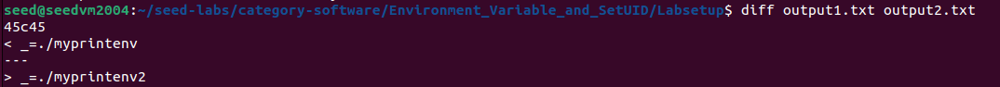
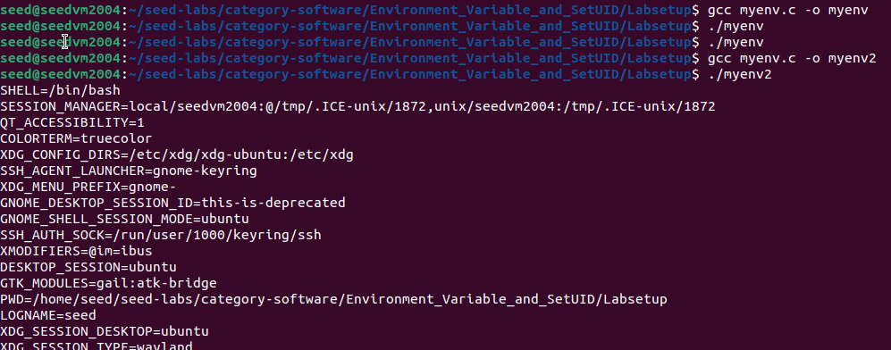
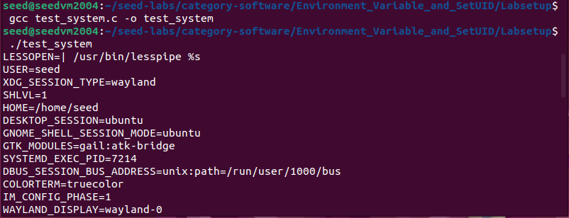
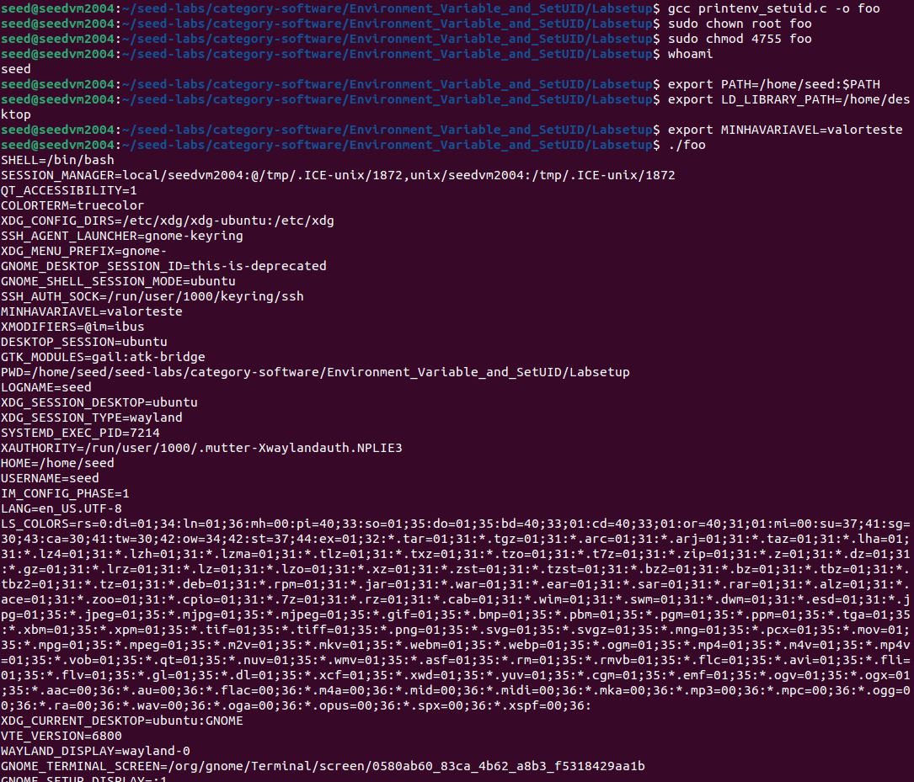
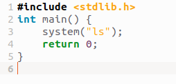
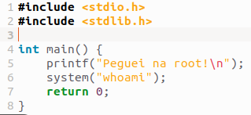
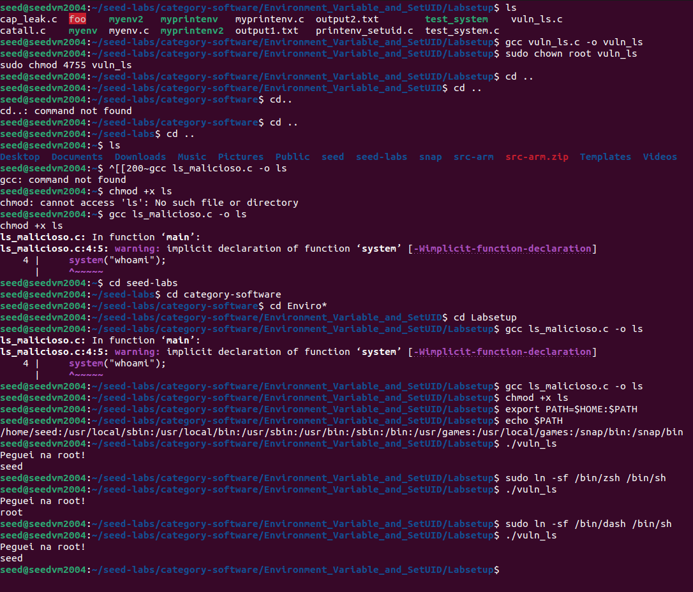
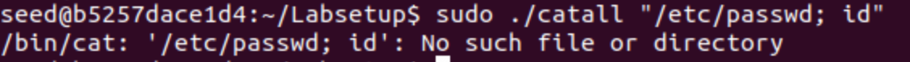
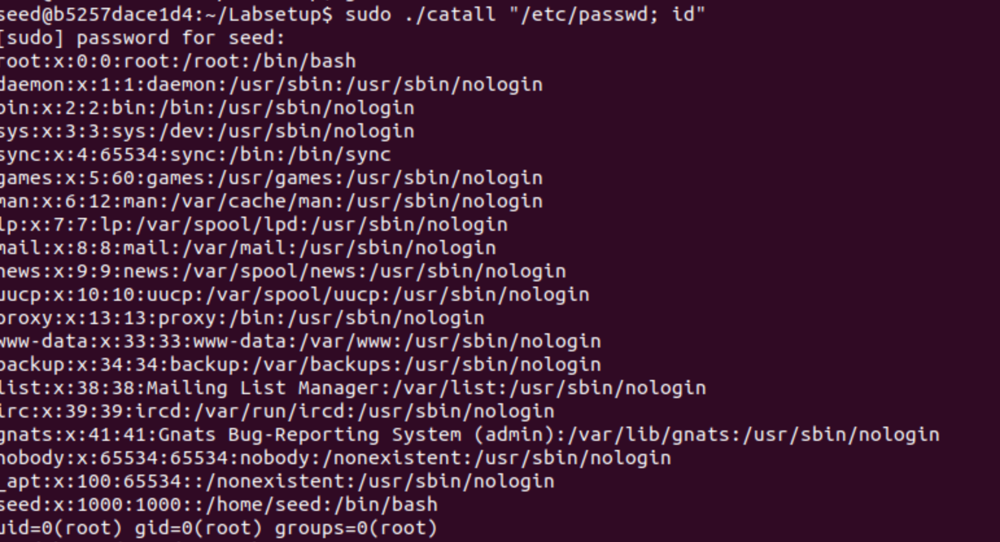
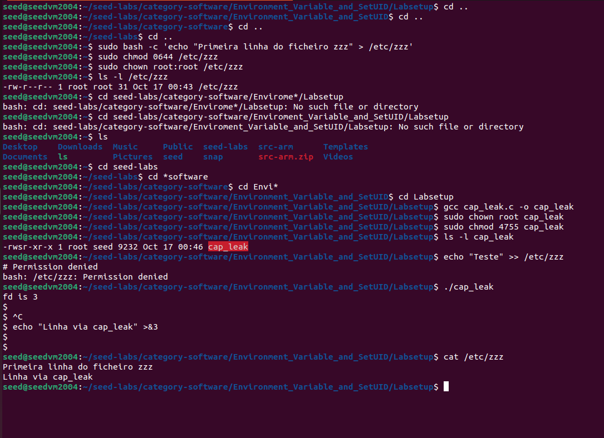

# LOGBOOK4

Este relatório documenta e analisa várias tarefas práticas realizadas no âmbito da unidade de segurança em sistemas operativos. Cada secção inclui preparação do ambiente, evidências da execução, explicação técnica dos resultados e medidas de mitigação para as vulnerabilidades exploradas. O objetivo é demonstrar, de forma fundamentada, conhecimentos práticos sobre proteção de recursos, escalonamento de privilégios e boas práticas de desenvolvimento seguro em ambiente Linux.


## QUESTÃO 1: Tasks 1-6 do Guião

## Task 1: Investigação de Variáveis de Ambiente

**Objetivo:** Familiarização com o comportamento das variáveis de ambiente em sistemas Unix.

**Comandos executados:**

`printenv export env`

**Observações:** As variáveis de ambiente são herdadas por defeito nos processos filhos e podem ser manipuladas através dos comandos **`export`**, **`env`** e visualizadas com **`printenv`**. Esta task serve como base para compreender o funcionamento das variáveis de ambiente antes de explorar vulnerabilidades relacionadas.

## Task 2: Passing Environment Variables from Parent Process to Child Process

**Objetivo:** Verificar se um processo filho herda variáveis de ambiente do processo pai.

**Passos realizados:**

1.  **Localização e compilação do ficheiro `myprintenv.c`:**

`gcc myprintenv.c`

2.  **Execução do programa original (child process):**

`./a.out > file1`

3.  **Modificação do código:** Comentar a chamada do child e descomentar a do parent no ficheiro **`myprintenv.c`**
4.  **Recompilação e execução:**

`gcc myprintenv.c ./a.out > file2`

5.  **Comparação dos resultados:**

`diff file1 file2`

**Resultado:** Os ficheiros file1 e file2 contêm variáveis de ambiente quase idênticas, demonstrando que os processos filhos herdam as variáveis de ambiente dos pais em sistemas Unix.



**Conclusão:** Os processos filhos herdam automaticamente as variáveis de ambiente dos pais através do mecanismo **`fork()`**, exceto quando explicitamente modificadas.

## Task 3: Environment Variables and execve()

**Objetivo:** Investigar como as variáveis de ambiente são tratadas com **`execve()`**.

**Código base implementado:**
```
#include <unistd.h> 
extern char **environ;

int main() { 
	char *argv; 
	argv = "/usr/bin/env"; 
	argv = NULL; 
	execve("/usr/bin/env", argv, NULL); 
	return 0; }
```
**Passos:**

1.  **Compilação inicial com `NULL` como terceiro argumento:**

`gcc myenv.c -o myenv ./myenv`

2.  **Alteração para usar `environ`:**

`execve("/usr/bin/env", argv, environ);`

3.  **Recompilação e execução:**

`gcc myenv.c -o myenv ./myenv`



**Conclusão:** O comportamento do ambiente passado para o novo processo depende do terceiro argumento do **`execve()`**. Com **`NULL`**, o processo fica sem ambiente; com **`environ`**, herda o ambiente existente. Não existe herança automática - o programador define explicitamente o ambiente do novo processo.

## Task 4: Environment Variables and system()

**Código implementado:**

```
#include <stdio.h> 
#include <stdlib.h>

int main() { 
	system("/usr/bin/env"); 
	return 0; 
	}
```

**Compilação e execução:**

`gcc test_system.c -o test_system ./test_system`




**Resultado:** Todas as variáveis de ambiente são listadas porque a função **`system()`** executa **`/bin/sh -c "/usr/bin/env"`** e a shell filha herda automaticamente as variáveis do processo original.

**Conclusão:** Quando se usa **`system()`**, o ambiente do processo original é automaticamente passado ao novo processo, porque o **`system()`** chama internamente o **`execl`** para executar **`/bin/sh`**, que recebe o ambiente do processo pai.

## Task 5: Environment Variables and Set-UID Programs

**Código implementado:**

```
#include <stdio.h> #include <stdlib.h>
extern char **environ;

int main() { 
	int i = 0; 
	while (environ[i] != NULL) { 
		printf("%s\n", environ[i]); 
		i++; } 
	return 0; }
```

**Passos:**

1.  **Compilação e configuração Set-UID:**

`gcc printenv_setuid.c -o foo sudo chown root foo sudo chmod 4755 foo`

2.  **Definição de variáveis de ambiente:**

`export PATH="$HOME:$PATH" export LD_LIBRARY_PATH="/qualquer" export MINHAVARIAVEL="qualquer"`

3.  **Execução:**

`./foo`



**Resultado:** Os programas Set-UID não recebem todas as variáveis definidas pelo utilizador. Variáveis como **`PATH`** e **`MINHAVARIAVEL`** aparecem, mas **`LD_LIBRARY_PATH`** é sanitizada por motivos de segurança, demonstrando o mecanismo de proteção contra privilege escalation.

**Conclusão:** Sistemas modernos removem/limpam certas variáveis de ambiente perigosas antes de iniciar programas Set-UID (ex: variáveis LD_*) para evitar ataques de manipulação do carregador dinâmico.

## Task 6: Ataque de Manipulação do PATH em Programas Set-UID

**Objetivo:** Demonstrar como subverter o comportamento do comando **`ls`** para executar código malicioso com permissões de administrador.

## Passos Detalhados do Ataque:

1.  **Criação do programa vulnerável (`vuln_ls.c`):**



    
2.  **Compilação e configuração Set-UID:**
    

`gcc vuln_ls.c -o vuln_ls sudo chown root vuln_ls sudo chmod 4755 vuln_ls`

3.  **Criação do `ls` malicioso (`ls_malicioso.c`):**



4.  **Compilação do código malicioso:**
    

`gcc ls_malicioso.c -o ls chmod +x ls`

5.  **Manipulação da variável PATH:**

`export PATH="$HOME:$PATH" echo $PATH *# confirmar que o diretório pessoal está primeiro*`

6.  **Primeiro teste (falhará em Ubuntu 20.04 por defeito):**

`./vuln_ls`

7.  **Contorno da proteção (apenas para demonstração):**

`sudo ln -sf /bin/zsh /bin/sh`

8.  **Execução do ataque bem-sucedido:**

`./vuln_ls`



9.  **Comando `whoami` para confirmar privilégios:**
    
    O comando **`whoami`** executado dentro do **`ls`** malicioso confirma que o código está a ser executado com privilégios de root.
    
10.  **Restauração do sistema:**
    

`sudo ln -sf /bin/dash /bin/sh`

## Explicação Técnica:

-   O programa **`vuln_ls`** executa **`system("ls")`** sem especificar o caminho absoluto
-   A função **`system()`** usa a variável **`PATH`** para localizar o comando **`ls`**
-   Ao manipular o **`PATH`** para incluir o diretório pessoal no início, o sistema executa o **`ls`** malicioso em vez do **`/bin/ls`** legítimo
-   O ataque só é bem-sucedido quando **`/bin/sh`** aponta para uma shell que não implementa proteções contra Set-UID (como **`zsh`**)
-   A shell **`/bin/dash`** (padrão no Ubuntu) previne este ataque ao remover automaticamente privilégios Set-UID

## Motivos Técnicos:

1.  **Resolução de PATH:** O sistema procura executáveis pela ordem definida na variável **`PATH`**
2.  **Herança de privilégios:** Programas Set-UID executam com privilégios do proprietário (root)
3.  **Proteções modernas:** Shells como **`dash`** implementam medidas de segurança que eliminam privilégios herdados
4.  **Vulnerabilidade:** Uso de **`system()`** sem caminhos absolutos permite manipulação via **`PATH`**


## QUESTÃO 2: Task 8 (Step 1)

## Contexto da Vulnerabilidade

O programa **`catall`** concatena **`/bin/cat`** com o argumento fornecido pelo utilizador e depois chama **`system(command)`**. A função **`system()`** faz essencialmente **`sh -c "command"`**, o que significa que qualquer metacaracter do shell presente em **`argv`** será interpretado pelo shell que **`system()`** invoca.

Como o programa tem permissões Set-UID, esse shell corre com os privilégios efetivos do processo (root), logo o utilizador pode injetar comandos arbitrários que serão executados com privilégios elevados.

## Código Vulnerável (catall.c)

`#include <string.h> #include <stdio.h> #include <stdlib.h>

int main(int argc, char *argv[]) { char command;

```
if(argc != 2) {
    printf("Please type a file name.\\n");
    return 1;
}

sprintf(command, "%s %s", "/bin/cat", argv);
system(command);
return 0;
}
```


## Passos do Ataque

1.  **Compilação e configuração do programa Set-UID:**

`gcc catall.c -o catall sudo chown root catall sudo chmod 4755 catall`

2.  **Primeiro teste - tentativa de acesso direto (falha):**

`sudo ./catall "/etc/passwd; id"`

**Resultado:** **`No such file or directory`** - O comando falha porque está a ser executado com **`sudo`**, então tenta concatenar literalmente o nome do ficheiro **`/etc/passwd; id`**.

3.  **Exploração bem-sucedida - injeção de comandos:**

`./catall "/etc/passwd; id"`

**Resultado:** O programa executa dois comandos:

-   Primeiro: **`cat /etc/passwd`** (mostra o conteúdo do ficheiro)
-   Segundo: **`id`** (mostra **`uid=0(root) gid=0(root) groups=0(root)`**)





## Explicação Técnica

## Vulnerabilidade - Step 1 (usando system(command))

-   **Problema:** **`argv`** não é sanitizado; metacaracteres do shell (**`;`**, **`|`**, **`&`**, **`>`**, **`$(...)`**, backticks, etc.) permitem ao atacante encadear comandos que o shell executa
-   **Consequência prática:** Um utilizador malicioso que tenha apenas permissão de execução do binário Set-UID pode, através desse argumento, fazer o programa executar comandos adicionais como root (por exemplo criar/remover/alterar ficheiros que normalmente não poderia)
-   **Razão técnica:** **`system()`** invoca um shell e o shell faz parsing do texto; a construção **`sprintf(command, "%s %s", "/bin/cat", argv)`** transforma o nome de ficheiro numa linha de comando passível de interpretação

## Mecânica do Ataque

Quando o utilizador fornece: **`./catall "/etc/passwd; id"`**

O programa constrói a string: **`/bin/cat /etc/passwd; id`**

A função **`system()`** interpreta isto como:

1.  Comando 1: **`/bin/cat /etc/passwd`**
2.  Separador: **`;`**
3.  Comando 2: **`id`**

Ambos os comandos são executados com privilégios de root devido ao bit Set-UID.

## Medidas de Mitigação

1.  **Nunca usar `system()` em programas privilegiados** - Usar **`fork()`** + **`execve()`** com argumentos separados
2.  **Sanitizar e canonicalizar nomes de ficheiros** - Usar **`realpath()`** e verificar que é ficheiro regular com as permissões corretas
3.  **Limpar o ambiente e reduzir privilégios** - Diminuir o privilégio antes de operar sobre ficheiros sempre que possível
4.  **Implementar logging e auditoria** - Registar todas as chamadas que lidam com ficheiros sensíveis

## Comparação: system() vs execve()

Se o código fosse alterado para usar **`execve()`**:

`char *v; v = "/bin/cat"; v = argv; v = NULL; execve(v, v, NULL);`

**Resultado:** **`execve("/bin/cat", v, NULL)`** chama diretamente o binário **`/bin/cat`** sem passar por um shell. O **`argv`** é passado como um argumento literal para o **`cat`**, e metacaracteres do shell não são interpretados - tornam-se parte do nome do ficheiro. As injeções que funcionavam com **`system()`** deixam de funcionar.

**Conclusão:** Trocar **`system()`** por **`execve()`** corrige a classe de vulnerabilidade causada por interpretação do shell.


## QUESTÃO 3: Task 9 - Capability Leaking

## Preparação do Ambiente

1.  **Criação do ficheiro de sistema protegido:**

`sudo bash -c "echo 'Primeira linha do ficheiro zzz' > /etc/zzz" sudo chmod 0644 /etc/zzz sudo chown root:root /etc/zzz ls -l /etc/zzz`

## Implementação do Programa Vulnerável

2.  **Código do programa `cap_leak.c`:**
```
#include <stdio.h> #include <stdlib.h> #include <fcntl.h> #include <unistd.h>

void main() { int fd; char *argv;


fd = open("/etc/zzz", O_RDWR | O_APPEND);
if (fd == -1) {
    printf("Cannot open /etc/zzz\\n");
    exit(0);
}

printf("fd is %d\\n", fd);

*// Perde privilégio root*
setuid(getuid());

argv = "/bin/sh";
argv = NULL;
execve("/bin/sh", argv, NULL);
}
```


3.  **Compilação e configuração Set-UID:**

`gcc cap_leak.c -o cap_leak sudo chown root cap_leak sudo chmod 4755 cap_leak ls -l cap_leak`

## Demonstração da Vulnerabilidade

4.  **Confirmação de que utilizador normal não pode escrever:**

`echo "Teste" >> /etc/zzz`

5.  **Execução do programa vulnerável:**

`./cap_leak`

6.  **Exploração do file descriptor herdado:**

`echo "Linha via cap_leak" >&3`

7.  **Verificação da escrita bem-sucedida:**

`cat /etc/zzz`




## Explicação Técnica da Vulnerabilidade

**Capability Leaking** ocorre quando um programa privilegiado:

1.  **Abre recursos com privilégios elevados:** O programa abre **`/etc/zzz`** enquanto executa como root (Set-UID), criando um file descriptor com permissões de escrita
2.  **Remove privilégios mas mantém recursos abertos:** Usa **`setuid(getuid())`** para voltar ao utilizador normal, mas não fecha o file descriptor privilegiado
3.  **Passa capacidades privilegiadas:** A shell herdada recebe o file descriptor aberto, permitindo acesso privilegiado mesmo sem privilégios diretos

## Medidas de Mitigação

Para prevenir capability leaking:

1.  **Fechar file descriptors privilegiados:** Sempre fechar todos os FDs abertos ANTES de remover privilégios
2.  **Usar FD_CLOEXEC:** Configurar file descriptors para serem automaticamente fechados em **`execve()`**
3.  **Princípio do mínimo privilégio:** Abrir ficheiros apenas após reduzir privilégios, quando possível
4.  **Remover capabilities explicitamente:** Usar **`cap_clear()`** para limpar capacidades herdadas
5.  **Validação de recursos:** Verificar e limpar todos os recursos privilegiados antes de transições de privilégio

## Recomendações de Programação Segura

-   Implementar sempre limpeza de recursos antes de **`setuid()`**
-   Usar bibliotecas de segurança que gerem capabilities automaticamente
-   Realizar auditorias de código focadas em transições de privilégio
-   Testar cenários de capability leaking durante desenvolvimento
-   Implementar logging de acessos a recursos privilegiados

## Conclusões

A vulnerabilidade de **Capability Leaking** demonstra como recursos privilegiados podem ser inadvertidamente mantidos após a redução de privilégios. Este tipo de vulnerabilidade é particularmente perigosa porque permite que utilizadores normais acedam a recursos protegidos através de file descriptors herdados, contornando efetivamente os mecanismos de controlo de acesso do sistema operativo.

O correto seria sempre fechar todos os file descriptors privilegiados antes de executar **`setuid()`** ou implementar mecanismos automáticos de limpeza de recursos em transições de privilégio.