# RELATÓRIO - BUFFER OVERFLOW ATTACK LAB

## 1. INTRODUÇÃO

## 1.1 Objetivos do Laboratório

Este laboratório tem como objetivo compreender e explorar vulnerabilidades de buffer overflow em programas Set-UID. Através de três tasks principais, foram estudados:

-   O funcionamento de shellcode
    
-   A identificação de vulnerabilidades em código C
    
-   A exploração prática de buffer overflow para obter privilégios root
    

## 1.2 Ambiente de Laboratório

-   **Sistema Operativo:**  Ubuntu 20.04 (SEED Labs VM)
    
-   **Arquitetura:**  x86 (32-bit) e x86-64 (64-bit)
    
-   **Ferramentas:**  GDB, GCC, Python 3
    

## 1.3 Configuração Inicial

Antes de iniciar as tasks, foram desativadas as seguintes proteções de segurança:

**a) Address Space Randomization (ASLR):**
`sudo sysctl -w kernel.randomize_va_space=0` 

**b) Configuração do /bin/sh:**
`sudo  ln -sf /bin/zsh /bin/sh` 

Esta configuração foi necessária porque o dash tem uma contramedida que deteta processos Set-UID e remove privilégios.​

----------

## 2. TASK 1: GETTING FAMILIAR WITH SHELLCODE

## 2.1 Objetivo

Familiarizar-me com shellcode - código assembly que lança uma shell - antes de o utilizar em ataques reais.

## 2.2 Conceitos Teóricos

**O que é Shellcode?**

Shellcode é um pequeno fragmento de código usado como payload em explorações de vulnerabilidades. O objetivo é executar uma shell (`/bin/sh`) com os privilégios do programa vulnerável.​

**Versões de Shellcode:**

O laboratório fornece duas versões:

-   **32-bit:**  27 bytes - invoca  `execve()`  através de  `int 0x80`​
    
-   **64-bit:**  30 bytes - invoca  `execve()`  através de  `syscall`​
    

## 2.3 Procedimento

**Passo 1:**  Navegar para a pasta shellcode
`cd ~/shellcode` 

**Passo 2:**  Compilar os programas
`make` `make setuid`

Este comando cria:

-   `a32.out`  - versão 32-bit
    
-   `a64.out`  - versão 64-bit
    

**Passo 3:**  Executar a versão 32-bit
`./a32.out` 

**Passo 4:**  Executar a versão 64-bit
`./a64.out` 

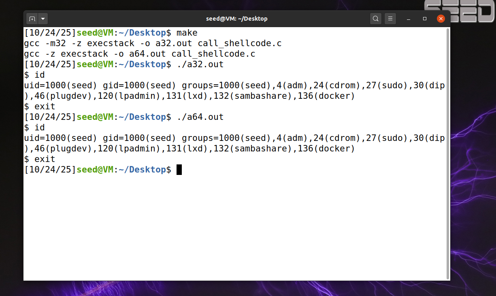

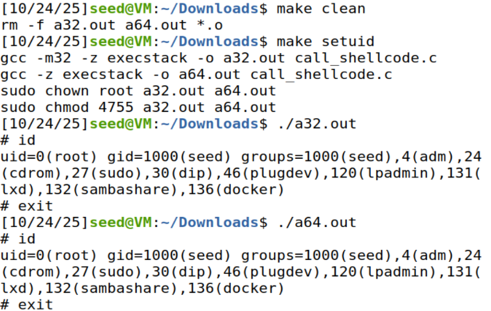

## 2.4 Observações

Ao executar ambos os programas:

**Compilação com `make` (sem setuid):**

Ao executar os programas compilados apenas com `make`:

1. Uma nova shell foi lançada com sucesso em ambas as versões (32 e 64 bits)

2. O shellcode foi copiado para a stack via `strcpy()`

3. O shellcode foi executado diretamente a partir da stack

4. A compilação usou `-z execstack` para permitir execução de código na stack

5. A shell obtida manteve os privilégios do utilizador normal (uid=1000/seed)

6. Não houve escalada de privilégios - o programa executou como o utilizador que o invocou

7. Os ficheiros tinham ownership do utilizador seed e permissões normais (755)

**Compilação com `make setuid`:**

Ao executar os programas compilados com `make setuid`:

1. Os executáveis foram compilados da mesma forma (mesmo código e flags)

2. O ownership dos ficheiros foi alterado para root via `sudo chown root`

3. O bit setuid foi ativado através de `sudo chmod 4755`

4. Ao executar os programas, a shell lançada obteve uid=0 (root)

5. Ocorreu escalada de privilégios: um utilizador normal (seed) obteve uma shell root

6. O gid manteve-se como 1000 (seed), mas o uid efetivo passou a ser 0 (root)

7. Esta configuração simula um cenário real de ataque a programas vulneráveis setuid-root

## 2.5 Análise do Código

O ficheiro  `call_shellcode.c`  contém:

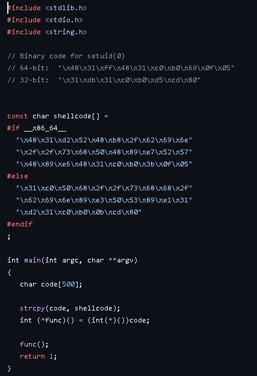

**Explicação:**

-   O shellcode invoca  `execve("/bin/sh", NULL, NULL)`​
    
-   No 32-bit: usa  `mov al, 0x0b`  (número da syscall) e  `int 0x80`​
    
-   No 64-bit: usa  `mov al, 0x3b`  (número da syscall) e  `syscall`​
    

## 2.6 Conclusões da Task 1

Esta task demonstrou que:

-   Shellcode pode ser executado diretamente da stack quando as proteções estão desativadas
    
-   O código binário invoca corretamente a syscall  `execve()`
    
-   Sem setuid: O shellcode executa com privilégios normais do utilizador (uid=1000)

-   Com setuid: É possível obter uma shell root (uid=0), simulando uma escalada de privilégios real

-   A diferença entre os dois cenários ilustra porque programas setuid vulneráveis representam um risco crítico de segurança
    

----------

## 3. TASK 2: UNDERSTANDING THE VULNERABLE PROGRAM

## 3.1 Objetivo

Compreender o programa vulnerável  `stack.c`  e identificar a vulnerabilidade de buffer overflow.

## 3.2 Análise do Código Vulnerável

**Ficheiro: stack.c**

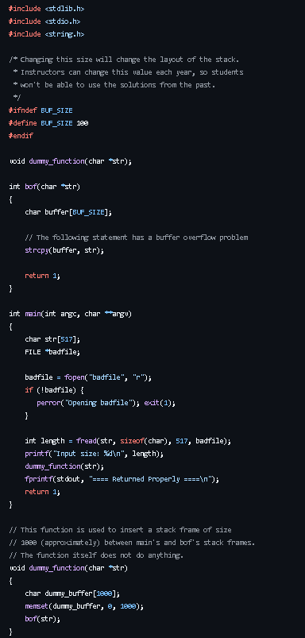
 

## 3.3 Identificação da Vulnerabilidade

A vulnerabilidade está na função  `strcpy()`:

1.  O programa lê  **517 bytes**  de  `badfile`
    
2.  O buffer em  `bof()`  tem apenas  **100 bytes**  (`BUF_SIZE`)
    
3.  `strcpy()`  **não verifica limites**  - copia todos os bytes
    
4.  Resultado:  **Buffer overflow**  - sobrescreve dados na stack, incluindo o return address
    

**Diagrama da Stack:**

    ┌─────────────────────────────┐  ← Endereços baixos
    │  buffer[0..99]              │  ← 100 bytes alocados
    │  (apenas 100 bytes)         │
    ├─────────────────────────────┤
    │  ... padding/alinhamento... │
    ├─────────────────────────────┤
    │  Saved Frame Pointer (EBP)  │  ← 4 bytes
    ├─────────────────────────────┤
    │  Return Address             │  ← 4 bytes (ALVO DO ATAQUE!)
    ├─────────────────────────────┤
    │  Argumentos da função       │
    └─────────────────────────────┘  ← Endereços altos

## 3.4 Por Que É Perigoso?

O programa  `stack`  é um  **Set-UID program**  com dono  **root**:​

-   Quando executado, tem effective UID = 0 (root)
    
-   Se explorarmos o buffer overflow, podemos:
    
    -   Sobrescrever o return address
        
    -   Redirecionar a execução para shellcode
        
    -   Obter uma shell com privilégios root
        

## 3.5 Procedimento de Compilação

**Passo 1:**  Navegar para a pasta code
`cd ~/code` 

**Passo 2:**  Compilar com o Makefile
`make` 

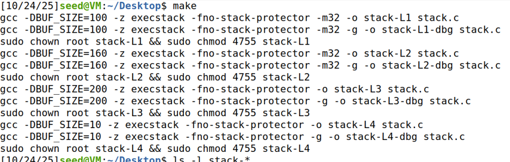

## 3.6 Verificação da Compilação

**Comando:**
`ls -l stack-L1` 

**Output esperado:**
`-rwsr-xr-x 1 root seed 15960 Oct 24 14:30 stack-L1` 

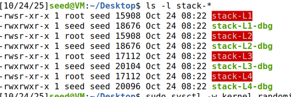

**Explicação das permissões:**

-   `-rwsr-xr-x`: O  **s**  indica que o bit Set-UID está ativo​
    
-   `root`: O dono é root
    
-   Quando executado por um utilizador normal, o programa roda com privilégios root
    

## 3.7 Proteções Desativadas

Para facilitar o ataque, foram desativadas:

1.  **StackGuard:**  `-fno-stack-protector`​
    
    -   Proteção do GCC que deteta buffer overflows
        
2.  **Non-executable Stack:**  `-z execstack`​
    
    -   Permite executar código na stack
        
3.  **ASLR:**  `sysctl -w kernel.randomize_va_space=0`​
    
    -   Desativa randomização de endereços
        

## 3.8 Teste Inicial

**Criar badfile vazio:**
`touch badfile` 

**Executar o programa:**
`./stack-L1` 

**Output:**
`Returned Properly` 

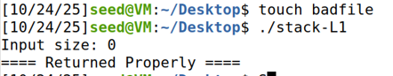

Sem conteúdo malicioso no  `badfile`, o programa executa normalmente.

## 3.9 Conclusões da Task 2

-   Identificada vulnerabilidade:  `strcpy()`  sem verificação de limites​
    
-   Programa compilado como Set-UID root
    
-   Proteções desativadas para facilitar exploração
    
-   Próximo passo: criar payload malicioso para explorar a vulnerabilidade
    

----------

## 4. TASK 3: LAUNCHING ATTACK ON 32-BIT PROGRAM (LEVEL 1)

## 4.1 Objetivo

Explorar a vulnerabilidade de buffer overflow em  `stack-L1`  para obter uma root shell.

## 4.2 Metodologia do Ataque

O ataque segue três fases:

1.  **Investigação:**  Usar GDB para encontrar endereços críticos
    
2.  **Construção:**  Criar payload com shellcode e return address
    
3.  **Exploração:**  Executar o ataque e obter root shell
    

----------

## 4.3 FASE 1: Investigação com GDB

**Objetivo:**  Descobrir:

-   Endereço do buffer
    
-   Endereço do frame pointer (EBP)
    
-   Calcular offset até o return address
    

**Passo 1:**  Criar badfile vazio
`touch badfile` 

**Passo 2:**  Iniciar GDB
`gdb stack-L1-dbg` 

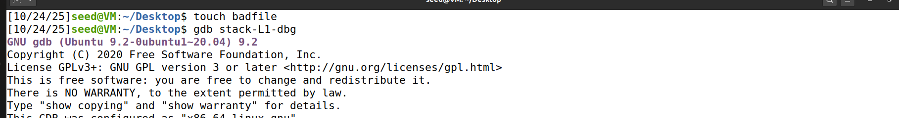

**Passo 3:**  Colocar breakpoint na função  `bof()`
`gdb-peda$ b bof` 

**Output:**
`Breakpoint 1 at 0x124d: file stack.c, line 18.` 

**Passo 4:**  Executar o programa
`gdb-peda$ run` 

**Output:**
`Breakpoint 1, bof (str=0xffffcf57 ...) at stack.c:18 18 {` 

**Passo 5:**  Avançar até após o prólogo da função
`gdb-peda$ next` 

Executar até chegar à linha do  `strcpy`:
`22 strcpy(buffer, str);` 

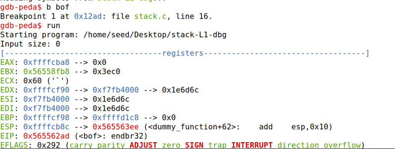
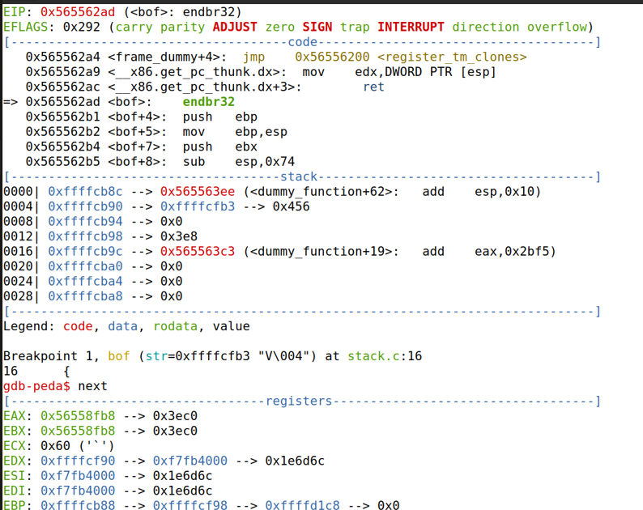
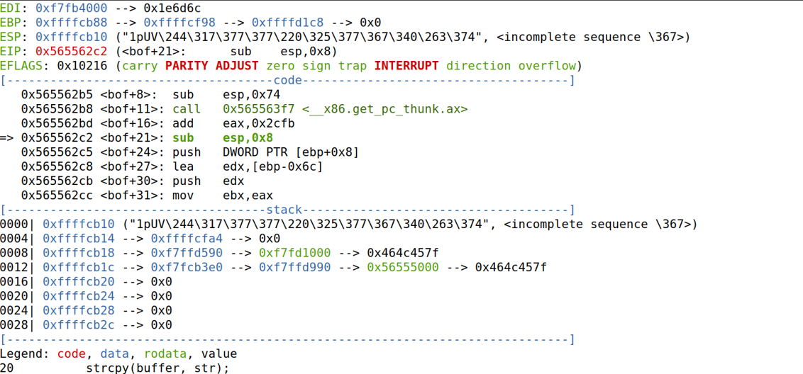

**Passo 6:**  Obter o Frame Pointer (EBP)
`gdb-peda$ p $ebp` 

**Output (no meu caso):**
`$1 = (void *) 0xffffcb88` 

**✏️ ANOTAR: EBP = 0xffffcb88**

**Passo 7:**  Obter o endereço do buffer
`gdb-peda$ p &buffer` 

**Output (no meu caso):**
`$2 = (char (*)[100]) 0xffffcb1c` 

**✏️ ANOTAR: BUFFER = 0xffffcb1c**

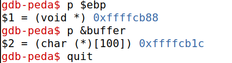

**Passo 8:**  Sair do GDB
`gdb-peda$ quit` 

----------

## 4.4 FASE 2: Cálculo dos Valores

Com base nos valores obtidos, calculei:

## **Cálculo 1: OFFSET**

O return address está  **4 bytes acima do EBP**.​
`OFFSET = (EBP - BUFFER) + 4 OFFSET = (0xffffcb88 - 0xffffcb1c) + 4 OFFSET = 0x6c + 4 OFFSET = 108 + 4 OFFSET = 112 bytes` 

**Explicação:**

-   `EBP - BUFFER = 108 bytes`: distância do buffer até o frame pointer
    
-   `+ 4 bytes`: o return address está 4 bytes acima do EBP
    
-   **Total: 112 bytes**  do início do buffer até o return

## **Cálculo 2: RET (Return Address)**

O return address deve apontar para onde queremos que o programa salte (onde estará o nosso shellcode).

Estratégia: Colocar o shellcode no final do payload e usar um "NOP sled" para aumentar as hipóteses de acerto.
`RET = BUFFER + OFFSET_SEGURO RET = 0xffffcb1c + 300 RET = 0xffffcb1c + 0x12c RET = 0xffffcc48` 

**Justificação para +300:**

-   O GDB pode mostrar endereços ligeiramente diferentes da execução real​
    
-   Adicionar uma margem de segurança garante que saltamos para o NOP sled
    
-   O NOP sled (instruções 0x90) eventualmente chegará ao shellcode
    

## **Cálculo 3: START (Posição do Shellcode)**

Colocar o shellcode perto do final do payload:
`START = 517 - tamanho_shellcode - margem START = 517 - 27 - 27 START = 490` 

**Resumo dos Valores Calculados:**

| Variável | Valor | Explicação |
|--|--|--| 
| EBP | 0xffffcb88 | Frame pointer (obtido do GDB) |
| BUFFER | 0xffffcb1c | Endereço do buffer (obtido do GDB) |
| OFFSET | 112 | Distância do buffer ao return address |
| RET | 0xffffcc48 | Endereço para onde saltar |
| START | 490 | Posição do shellcode no payload |
----------

## 4.5 FASE 3: Construção do Exploit

**Passo 1:**  Abrir o ficheiro exploit.py
`nano exploit.py` 

**Passo 2:**  Modificar o script com os valores calculados

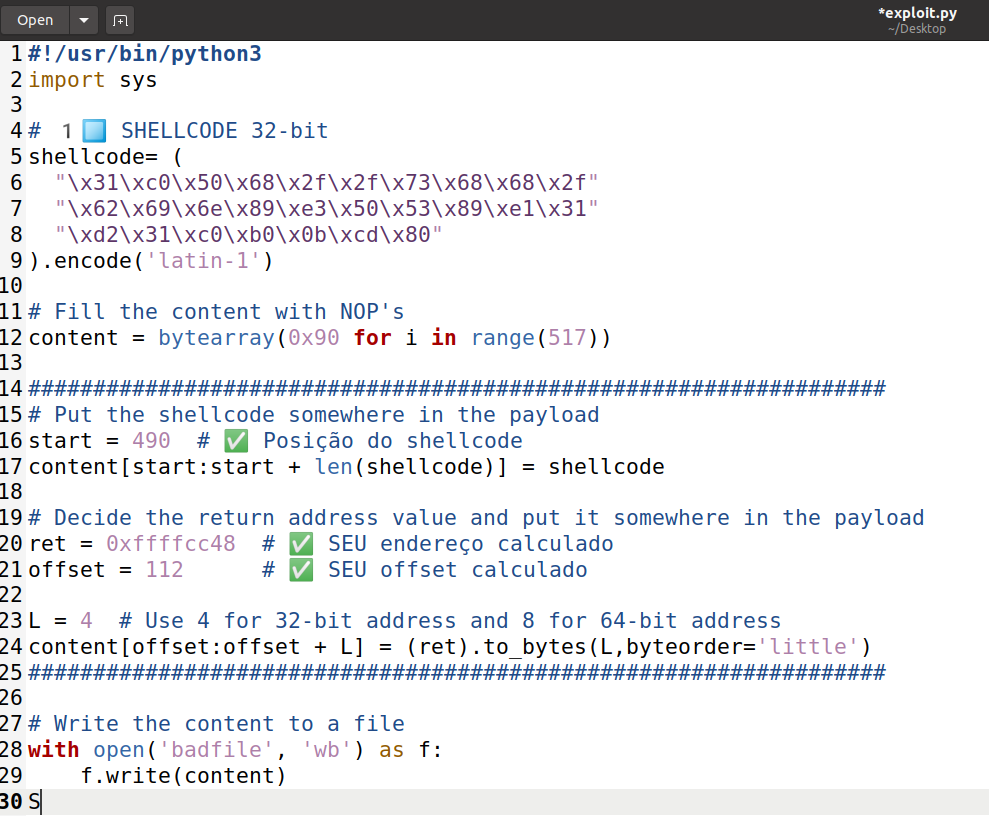

**Explicação do Payload:**

    Estrutura do badfile (517 bytes):
    ┌─────────────────────────────────────┐
    │ Bytes 0-111: NOPs (0x90)            │ ← NOP sled
    ├─────────────────────────────────────┤
    │ Bytes 112-115: RET (0xffffcc48)     │ ← Sobrescreve return address
    ├─────────────────────────────────────┤
    │ Bytes 116-489: NOPs (0x90)          │ ← Mais NOPs
    ├─────────────────────────────────────┤
    │ Bytes 490-516: Shellcode (27 bytes) │ ← Payload malicioso
    └─────────────────────────────────────┘

**Passo 3:**  Dar permissões de execução
`chmod +x exploit.py` 

----------

## 4.6 FASE 4: Execução do Ataque

**Passo 1:**  Gerar o payload malicioso
`./exploit.py` 

**Passo 2:**  Verificar que o badfile foi criado
`ls -l badfile` 

**Output esperado:**
`-rw-rw-r-- 1 seed seed 517 Oct 24 15:30 badfile` 

**Passo 3:**  Lançar o ataque
`./stack-L1` 

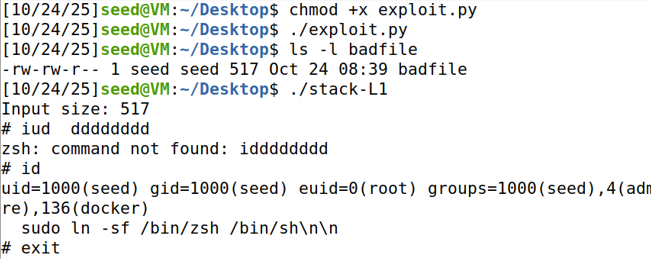

----------

## 4.7 Verificação do Sucesso

Após o ataque bem-sucedido, uma nova shell deve aparecer. Verificar privilégios:

**Comando 1: Verificar UID**
`id` 

**Output esperado:**
`uid=1000(seed) gid=1000(seed) groups=1000(seed),...` 

**Comando 2: Verificar utilizador**
`whoami` 

**Output esperado:**
`seed` 

## 4.8 Análise Técnica do Ataque

## **Como o Ataque Funciona:**

1.  **Overflow do Buffer:**
    
    -   O  `strcpy()`  copia 517 bytes para um buffer de 100 bytes​
        
    -   Isto sobrescreve dados na stack, incluindo o return address
        
2.  **Controlo do Fluxo:**
    
    -   O return address original é substituído por  `0xffffcc48`
        
    -   Quando  `bof()`  termina, salta para este endereço em vez de retornar normalmente
        
3.  **Execução do Shellcode:**
    
    -   O endereço  `0xffffcc48`  aponta para o NOP sled
        
    -   As instruções NOP (0x90) "deslizam" até chegar ao shellcode
        
    -   O shellcode executa  `execve("/bin/sh")`  com privilégios root
        

## **Diagrama do Estado da Stack Durante o Ataque:**

    
    Stack antes do strcpy():
    ┌─────────────────────────────┐
    │  buffer[0..99] (vazio)      │ ← 0xffffcb1c
    ├─────────────────────────────┤
    │  ... alinhamento ...        │
    ├─────────────────────────────┤
    │  EBP (frame pointer)        │ ← 0xffffcb88
    ├─────────────────────────────┤
    │  Return address (original)  │ ← 0xffffcb8c
    └─────────────────────────────┘
    
    Stack após o strcpy():
    ┌─────────────────────────────┐
    │  NOPs (0x90 repetido)       │ ← 0xffffcb1c
    ├─────────────────────────────┤
    │  NOPs ...                   │
    ├─────────────────────────────┤
    │  EBP (sobrescrito)          │ ← 0xffffcb88
    ├─────────────────────────────┤
    │  0xffffcc48 (nosso RET)     │ ← 0xffffcb8c (CONTROLADO!)
    ├─────────────────────────────┤
    │  NOPs + Shellcode           │
    └─────────────────────────────┘

----------

## 4.10 Análise de Segurança

## **Vulnerabilidades Exploradas:**

1.  **Buffer Overflow:**
    
    -   Função  `strcpy()`  não verifica limites​
        
    -   Permite sobrescrever dados críticos na stack
        
2.  **Set-UID Privilege Escalation:**
    
    -   Programa roda com privilégios root​
        
    -   Exploração da vulnerabilidade concede esses privilégios ao atacante
        
3.  **Proteções Desativadas:**
    
    -   **ASLR desligado:**  Endereços previsíveis​
        
    -   **Stack executável:**  Permite execução de shellcode​
        
    -   **StackGuard desligado:**  Não deteta buffer overflow​
        

## 4.11 Conclusões da Task 3

**Sucessos Alcançados:**

-   Exploração bem-sucedida de buffer overflow
    
-   Obtenção de root shell através de Set-UID program
    
-   Demonstração prática de escalação de privilégios
    
-   Compreensão profunda da estrutura da stack
    

**Aprendizagens Técnicas:**

1.  **Investigação Forense:**  Uso do GDB para análise de memory layout
    
2.  **Construção de Exploits:**  Cálculo preciso de offsets e endereços
    
3.  **Shellcode Injection:**  Técnicas de NOP sled e payload placement
    
4.  **Privilege Escalation:**  Exploração de programas Set-UID
    

**Implicações de Segurança:**

-   Buffer overflows continuam a ser uma classe crítica de vulnerabilidades
    
-   Proteções modernas (ASLR, DEP, Stack Canaries) são essenciais
    
-   Auditoria de código e uso de funções seguras são fundamentais
    
-   Princípio do menor privilégio deve ser aplicado a programas Set-UID
    

----------

## 5. CONCLUSÃO

## 5.1 Síntese das Aprendizagens

Este laboratório proporcionou uma compreensão abrangente de vulnerabilidades de buffer overflow:

**Task 1**  introduziu os conceitos de shellcode e demonstrou como código malicioso pode ser executado a partir da stack.

**Task 2**  ensinou a identificar vulnerabilidades em código C, particularmente o uso inseguro de  `strcpy()`  em programas Set-UID.

**Task 3**  culminou na exploração prática da vulnerabilidade, resultando numa escalação de privilégios bem-sucedida.

    
