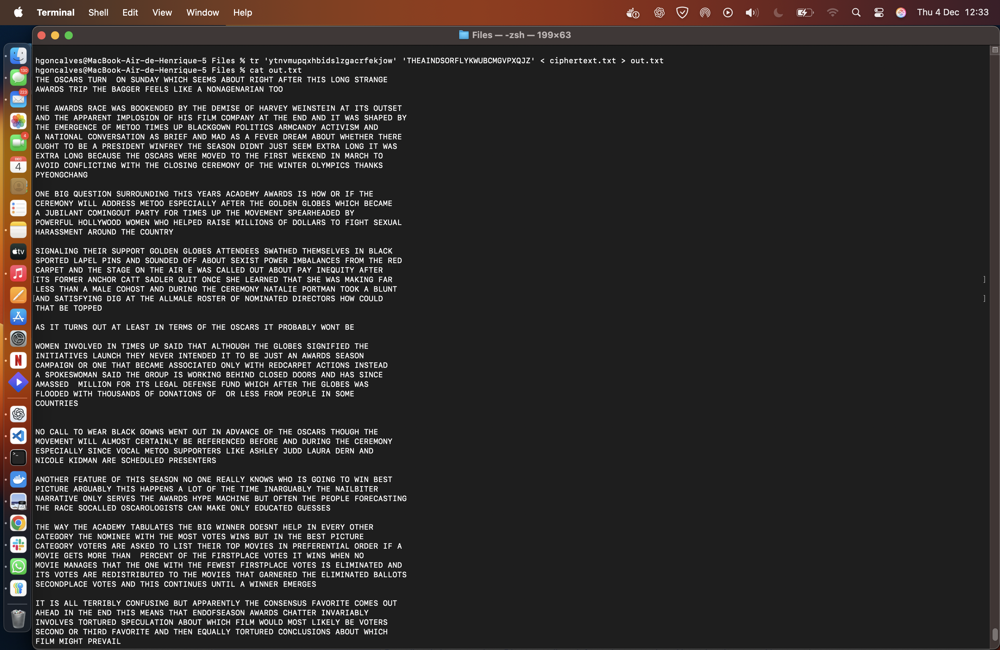
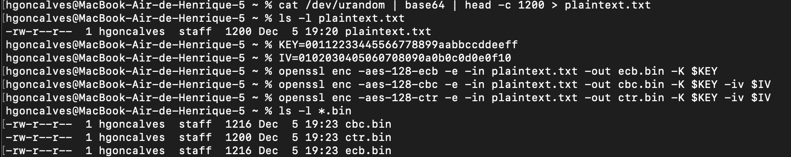
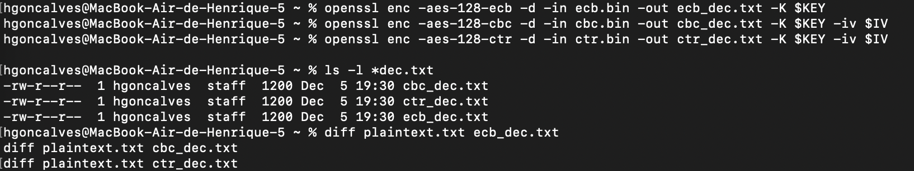
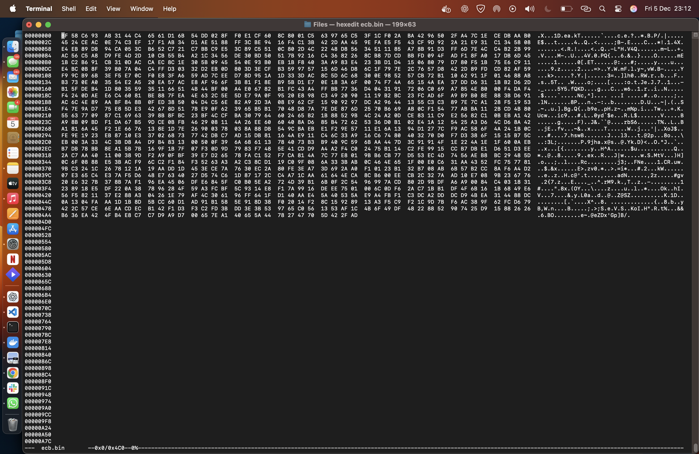
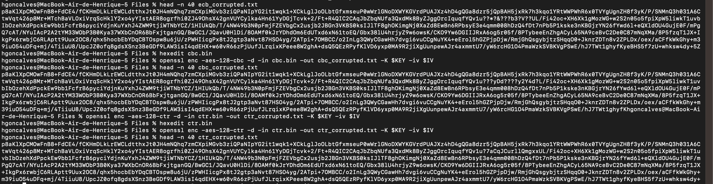

# LOGBOOK9 – Secret-Key Encryption Lab

## 1. Introdução

Neste relatório descrevemos o trabalho efetuado no laboratório **SEED Labs – Secret-Key Encryption**, cujo objetivo principal foi explorar cifragem simétrica, modos de operação do AES e comportamento perante erros de transmissão.

Foram analisadas as tasks **1, 2 e 5** do guião, com adaptações e respostas adicionais fornecidas pelo docente.


## 2. Task 1 — Frequency Analysis

Nesta tarefa analisámos a cifra por substituição monoalfabética. Usámos:

- O script `freq.py` para frequências.
- Consolidação progressiva, substituindo com `tr`:

```bash
tr 'cipherletters' 'PLAINLETTERS' < ciphertext.txt > test.txt
```

O ficheiro final revelou um texto coerente e inteligível, confirmando o sucesso da análise por frequências.


## 3. Task 2 — Modos AES (ECB, CBC e CTR)

Foi usado o ficheiro `plaintext.txt` gerado com tamanho superior a 1000 bytes através de:

```bash
cat /dev/urandom | base64 | head -c 1200 > plaintext.txt
```

### 3.1 Comandos usados

#### Cifragem:
```bash
openssl enc -aes-128-ecb -e -in plaintext.txt -out ecb.bin -K <KEY>
openssl enc -aes-128-cbc -e -in plaintext.txt -out cbc.bin -K <KEY> -iv <IV>
openssl enc -aes-128-ctr -e -in plaintext.txt -out ctr.bin -K <KEY> -iv <IV>
```

#### Decifragem:
```bash
openssl enc -aes-128-ecb -d -in ecb.bin -out ecb_dec.txt -K <KEY>
openssl enc -aes-128-cbc -d -in cbc.bin -out cbc_dec.txt -K <KEY> -iv <IV>
openssl enc -aes-128-ctr -d -in ctr.bin -out ctr_dec.txt -K <KEY> -iv <IV>
```


### 3.2 Flags utilizadas e diferenças

| Flag | Significado |
|-----|-------------|
`-e` | Cifrar  
`-d` | Decifrar  
`-K` | Chave (hex)  
`-iv` | Vetor inicial (CBC e CTR requerem)  

### 3.3 Diferenças teóricas entre modos

- **ECB**: blocos independentes; padrões visíveis.
- **CBC**: encadeamento via XOR com bloco anterior.
- **CTR**: produz fluxo; XOR com plaintext; não usa padding.

### 3.4 Diferença principal do CTR

No **CTR**, cifrar e decifrar são operações simétricas (XOR com keystream), logo:

- Não há propagação de erros.
- Não tem padding.
- Funciona como cifra de fluxo.


## 4. Task 5 — Propagação de Erros

Alterámos **um byte** em cada criptograma (`*.bin`) usando o editor `hexedit` (não foi possível usar bless devido ao macOS), na posição 150.

Hexedit:



Após decifragem:


### 4.1 Observação prática

| Modo | Número de bytes afetados | Interpretação |
|-----|---------------------------|---------------|
ECB | ≈16 | afeta só o bloco |
CBC | ≈32 | afeta 2 blocos |
CTR | 1 | erro local apenas |

### 4.2 Conclusão

- ECB sofre corrupção local.
- CBC propaga a corrupção.
- CTR é tolerante a erros (comporta-se como cifra de fluxo).


## 5. Conclusão Geral

- Os modos de cifra têm impacto importante na tolerância ao erro.
- CTR apresenta melhor preservação de informação após corrupção.
- O laboratório permitiu consolidar o uso prático de AES com diferentes modos.
